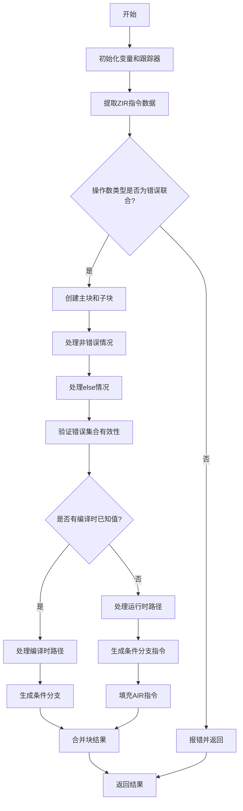

嗯，我需要为这个Zig函数`zirSwitchBlockErrUnion`画一个流程图。首先，我需要理解这个函数的结构和逻辑流程。让我先通读一遍代码，看看它大致做了些什么。

函数开始的时候，有一些初始化的步骤，比如获取跟踪器、处理参数，然后从ZIR指令中提取各种信息，比如操作数、源代码位置等。接着，它处理错误联合类型，检查操作数的类型是否是错误联合类型，如果不是的话，就返回一个编译错误。

然后，函数创建了一个新的块（block）和子块（child_block），处理不同的情况，比如标量案例（scalar cases）和多案例（multi cases）。之后，它处理非错误情况（non_error_case）和else情况（else_case）。接下来，它解析错误集合，验证错误集合的切换是否有效，并处理可能的错误捕获。

在代码的后半部分，函数处理运行时的情况，生成条件分支指令（cond_br），根据条件跳转到不同的代码块，处理错误或正常流程。最后，它解析并返回分析后的块结果。

现在，我需要把这些步骤分解成流程图中的各个节点。可能的结构包括开始、初始化、检查错误联合类型、处理不同案例、处理运行时条件、生成条件分支、结束等步骤。需要注意的是错误处理和不同分支的流向，比如当操作数类型不符合预期时的错误返回，或者当错误集合为空时的处理等。

在画流程图时，可能需要使用条件判断节点（菱形）来表示不同的条件分支，如检查操作数类型是否为错误联合类型，或者是否处于编译时等。每个处理步骤可以用矩形框表示，箭头表示流程的方向。还需要注意循环或递归的部分，但在这个函数中似乎没有明显的循环，主要是条件分支和子块的处理。

可能遇到的困难是理解某些复杂的逻辑部分，比如`spa`结构的作用，以及如何处理不同的案例和错误捕获。需要确保流程图的每个步骤都正确反映了代码的逻辑，尤其是在条件分支和错误处理的部分。

总结一下，流程图的大致步骤可能是：

1. 开始
2. 初始化变量和获取必要的数据
3. 检查操作数是否为错误联合类型，如果不是则报错
4. 创建新的块和子块
5. 处理非错误情况（non_error_case）
6. 处理else情况（else_case）
7. 验证错误集合的有效性
8. 处理编译时已知的值
9. 处理运行时的情况，生成条件分支
10. 结束并返回结果

在绘制过程中，需要详细标注每个步骤的具体操作，以及条件分支的判断条件和结果流向。
================================================

流程图说明：
1. **初始化阶段**：获取调试跟踪器，解析ZIR指令结构，提取操作数信息
2. **类型检查**：核心判断逻辑，确保操作数是错误联合类型
3. **分支处理**：
   - 非错误分支（payload）处理
   - else分支（错误处理）的特殊处理
   - 错误集合的交叉验证
4. **编译时/运行时路径分离**：
   - 编译时已知值直接解析
   - 运行时值生成条件跳转指令
5. **代码生成**：
   - 通过cond_br指令实现控制流
   - 填充AIR中间表示指令
6. **结果合并**：整合子块的分析结果返回给调用者

关键决策点用菱形表示，操作步骤用矩形表示，箭头方向表示控制流走向。