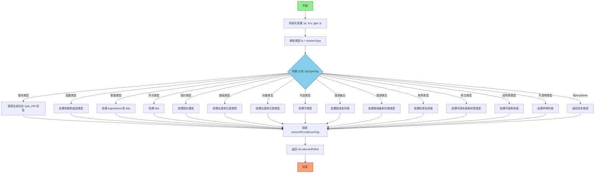

嗯，我现在需要为一个名为`zirTypeInfo`的Zig函数画流程图。首先，我得仔细看看这个函数的结构和逻辑。这个函数看起来挺长的，有很多分支和不同的类型处理情况。我需要理清主要的流程步骤。

首先，函数开始时获取了一些变量，比如`pt`、`zcu`、`gpa`等。然后处理了类型信息，根据不同的类型标签（ZigTypeTag）进入不同的分支。例如，处理`.type`、`.void`等基本类型，然后处理函数类型`.@"fn"`，接着是整数类型`.int`，浮点类型`.float`，指针类型`.pointer`，数组类型`.array`，向量类型`.vector`，可选类型`.optional`，错误集合`.error_set`，错误联合`.error_union`，枚举类型`.@"enum"`，联合类型`.@"union"`，结构体类型`.@"struct"`，不透明类型`.@"opaque"`，以及帧和anyframe类型。

每个类型分支内部都有具体的处理逻辑，比如获取内置类型，构造字段值，最后返回相应的Air指令引用。有些分支还会调用其他函数，比如`unionInitFromEnumTag`或`sema.failWithUseOfAsync`。

接下来，我需要将这些逻辑转化为流程图。流程图应该从函数入口开始，然后根据类型标签分支出不同的处理路径。每个分支处理完毕后，最终返回结果。需要注意的是，有些分支内部有复杂的结构，比如循环分配内存、处理字段等，但流程图可能需要简化这些步骤，突出主要判断和处理节点。

可能的结构是：

1. 函数开始，初始化变量。
2. 解析类型，获取类型标签。
3. 根据类型标签进入不同的case。
4. 每个case处理对应的类型信息，构造相应的值。
5. 返回构造的结果。

对于每个case，可以简化为一个处理步骤，比如“处理函数类型参数”、“构造整数类型信息”等。复杂的内部处理可以用子流程表示，但为了简洁，可能不需要展开所有细节。

最后，需要考虑错误处理，比如`try`语句可能导致的提前返回，但流程图可能不需要显示所有错误路径，除非特别重要。

总结起来，流程图的大纲是：开始 -> 初始化变量 -> 解析类型 -> 根据类型分支处理 -> 构造对应类型信息 -> 返回结果。每个主要类型分支作为一个节点，连接起来形成流程。
================================================

流程说明：
1. 函数入口初始化关键变量
2. 解析目标类型后进入类型判断分支
3. 每个类型分支处理特定逻辑：
   - 基本类型直接映射标准标签
   - 复合类型（函数/结构体等）需要构建详细元信息
   - 异步相关类型直接返回错误
4. 所有分支最终通过`unionInitFromEnumTag`统一构造类型信息
5. 最终将结果转换为AIR指令引用并返回

灰色节点表示控制逻辑，蓝色节点表示类型分支，绿色节点表示入口，橙色节点表示出口。