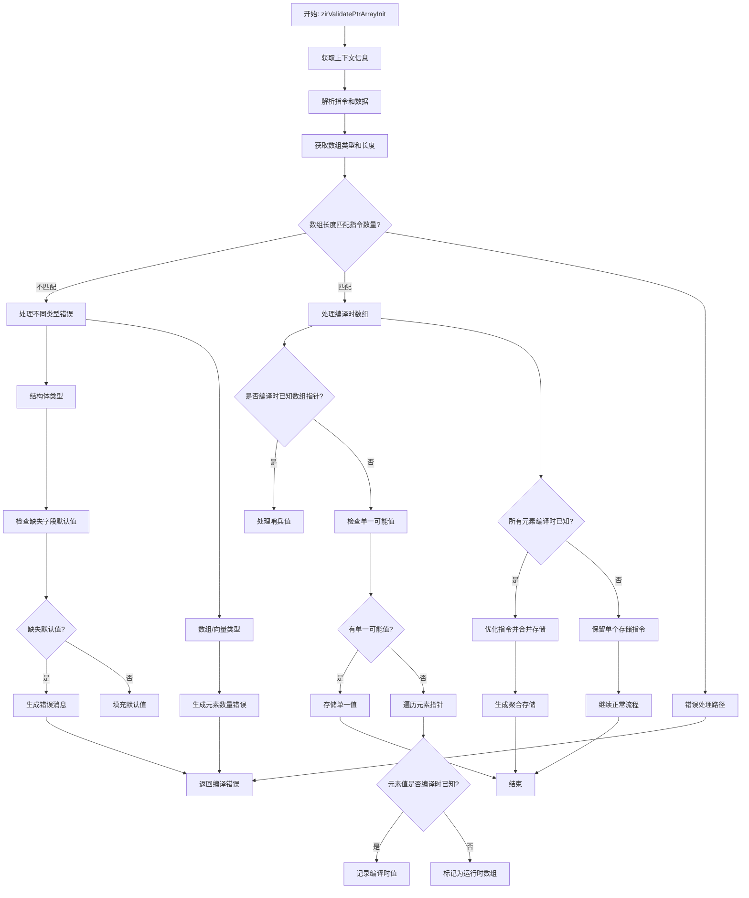

嗯，我需要为这个Zig函数`zirValidatePtrArrayInit`画一个流程图。首先，我得理解这个函数是做什么的。看起来像是验证指针数组的初始化，处理编译时的检查和一些代码生成。

首先，我会通读整个函数，找出主要的步骤和条件分支。函数开始获取一些上下文信息，比如`pt`、`zcu`，然后解析指令和数据。接着处理数组长度和元素值的收集，这里可能有一些错误处理，比如检查数组长度是否匹配，结构体字段是否缺失默认值等。

然后，函数检查是否在编译时已知数组指针，如果是，可能需要处理哨兵值（sentinel）。接下来，处理数组的可能值，如果只有一个可能值，就直接存储。然后进入一个循环，遍历每个元素指针，检查存储的值是否是编译时已知的，并更新`element_vals`数组。

在后面的部分，如果所有元素都是编译时已知的，函数会优化掉不必要的指令，合并成一个整体的存储操作。否则，继续处理每个元素的存储。

我需要将这些步骤分解成流程图中的节点，并连接条件分支。可能的条件包括数组类型（结构体、数组、向量）、是否在编译时、元素是否缺失默认值、元素值是否是编译时已知等。

需要注意的是错误处理部分，比如当结构体字段缺少默认值时生成错误消息。此外，处理不同数组类型时的不同错误提示，以及如何处理编译时已知的数组和运行时数组。

在绘制流程图时，应该从函数入口开始，按照逻辑顺序逐步展开每个主要步骤，使用判断节点处理条件分支，比如检查数组长度是否匹配、类型是否为结构体等。然后根据不同的条件走向不同的处理流程，比如生成错误、处理哨兵值、优化存储指令等。

最后，确保流程图的每个节点都有明确的动作或判断，并且连接正确，没有遗漏重要的步骤。可能需要多次检查代码逻辑，确保流程图的准确性。
================================================

流程图说明：
1. 函数从上下文信息获取开始，解析ZIR指令
2. 核心逻辑分为数组长度验证、编译时处理、运行时处理三条主线
3. 通过多个条件判断处理不同类型（结构体/数组/向量）的差异
4. 包含错误处理路径和编译时优化路径
5. 最终通过不同路径收敛到存储操作或错误返回
6. 突出显示了编译时值检测、指令优化和错误消息生成等关键环节