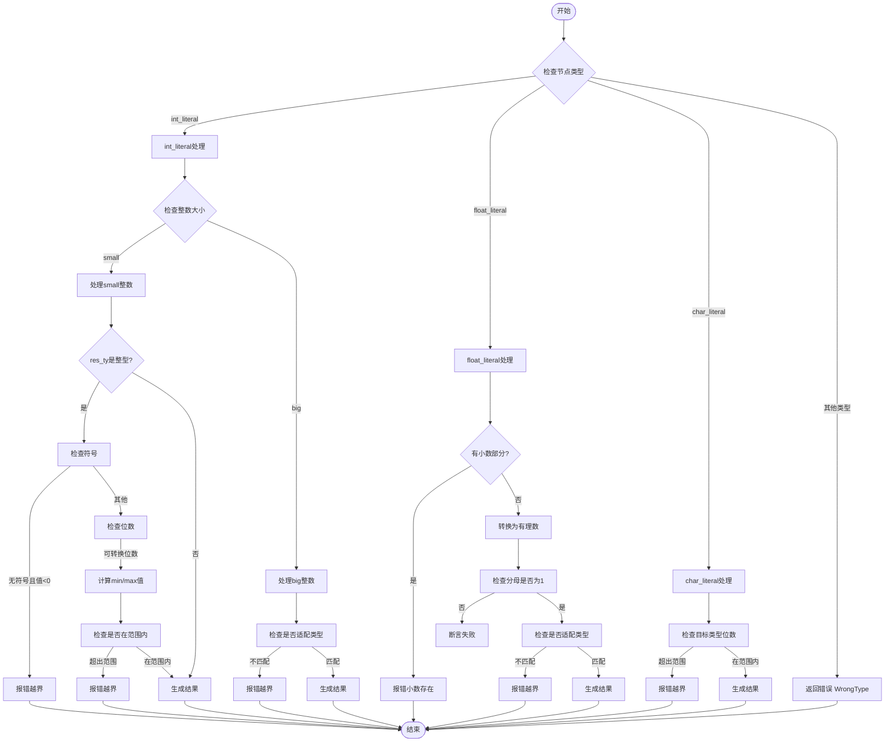

好的，我现在要帮助用户将给定的Zig函数`lowerInt`转换为Mermaid流程图。首先，我需要理解这个函数的结构和逻辑流程，这样才能准确地画出流程图。

首先，我会通读代码，了解函数的主要分支和逻辑。函数`lowerInt`处理不同类型的节点（如整数、浮点数、字符字面量等），并根据不同的情况执行相应的操作，比如类型检查和错误处理。

函数开始于`@setFloatMode(.strict);`，然后进入一个`switch`语句，根据`node.get(self.file.zoir.?)`的结果分派到不同的处理分支。每个分支对应不同的节点类型：`.int_literal`、`.float_literal`、`.char_literal`，以及默认的`else`分支返回错误。

对于每个分支，尤其是`.int_literal`，有更详细的处理逻辑。例如，`.int_literal`分为`.small`和`.big`两种情况，分别处理小整数和大整数。这里需要检查结果类型`res_ty`是否为整数类型，并进行范围检查，确保值不会超出目标类型的表示范围。如果超出，则调用`self.fail`返回错误。

接下来是`.float_literal`分支，这里需要检查浮点数是否有小数部分，如果有则报错。然后将浮点数转换为有理数形式，并进一步检查是否符合目标整数类型的范围。

`.char_literal`分支处理字符字面量，同样进行范围检查，确保字符值在目标整数类型的范围内。

每个分支最后都会调用`self.sema.pt.intern`来生成结果。

现在，我需要将这些逻辑步骤转化为流程图。流程图的开始是函数入口，然后根据不同的节点类型分支出不同的处理路径。每个分支内部的条件判断（如类型检查、范围检查）需要作为决策节点，成功则继续，失败则报错并返回。最后，每个分支处理完毕后都会生成结果并返回。

需要注意的是，流程图的节点应清晰表示每个判断和处理步骤，使用菱形表示条件判断，矩形表示操作步骤，椭圆形表示开始和结束。同时，错误处理路径应明确标出。

在绘制过程中，可能需要合并一些重复的步骤，例如多个分支中的类型检查和错误处理，可以抽象为共同的步骤，但根据代码结构，每个分支有独立的处理逻辑，因此需要分别表示。

最后，确保流程图的箭头正确连接每个步骤，逻辑顺序与代码一致，没有遗漏重要的判断或操作。
================================================
