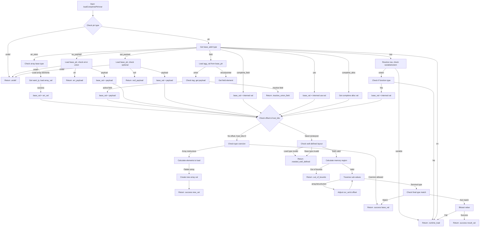

好的，我现在需要为提供的Zig函数`loadComptimePtrInner`绘制流程图。首先，我需要理解这个函数的功能和结构。

这个函数的主要作用是在编译时加载指针指向的值。它处理各种指针类型和结构，比如数组、结构体、联合体等，并确保类型转换和内存布局的正确性。函数返回一个`ComptimeLoadResult`，可能包含成功加载的值、错误信息或其他状态。

接下来，我需要分析函数的逻辑流程。函数开始处检查指针的类型，如果是未定义或普通指针，则进行相应处理。然后根据指针的`base_addr`类型（如`nav`、`comptime_alloc`、`uav`等）获取基础值`base_val`。之后，处理不同的指针偏移和类型转换，包括数组元素的访问、结构体和联合体的字段访问。在处理过程中，需要检查内存布局是否明确，是否越界，以及进行必要的类型转换。

接下来，我需要将这些步骤转化为流程图。流程图应包括以下主要部分：

1. 函数入口。
2. 检查指针类型（undef、ptr等）。
3. 根据`base_addr`的不同类型处理获取`base_val`。
4. 处理指针偏移（byte_offset、array_offset等）。
5. 检查内存布局是否明确，是否越界。
6. 处理数组、结构体、联合体的元素访问。
7. 最终类型转换和返回结果。

需要注意的是，函数中存在多个条件分支和循环，例如处理数组元素时的循环访问，以及结构体字段的遍历。这些都需要在流程图中体现出来。

可能遇到的挑战是如何将复杂的逻辑分支简洁地表达出来，同时保持流程图的清晰。需要合理分组条件判断，使用子流程或分支节点来简化复杂部分。另外，需要确保每个返回路径（如返回.success、.undef、.runtime_load等）都被正确表示。

最后，根据以上分析，使用Mermaid语法绘制流程图，确保每个步骤和分支都准确反映函数的执行流程。
================================================

该流程图展示了函数的主要逻辑路径：
1. 根据指针类型进行初始处理
2. 处理不同类型的基地址（base_addr）
3. 检查偏移量和内存布局
4. 处理数组/结构体/联合体的内存访问
5. 最终的类型转换和结果返回
关键分支点包括：指针类型判断、内存布局验证、数组重构、位转换操作等。异常路径（如越界访问、非活跃联合字段等）用红色箭头表示，正常路径用绿色箭头表示。