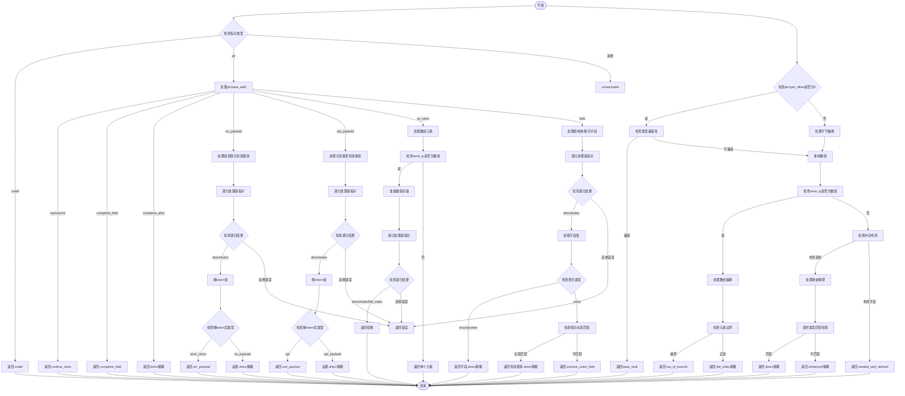

好的，我需要为提供的 Zig 函数 `prepareComptimePtrStore` 绘制一个流程图。首先，我需要理解这个函数的结构和逻辑。

函数的主要目的是处理编译时指针存储的策略。它接受多个参数，包括语义分析器（sema）、块（block）、源代码位置（src）、指针值（ptr_val）、存储类型（store_ty）和数组偏移量（array_offset）。返回一个 `ComptimeStoreStrategy` 或错误。

首先，函数检查指针值的类型，根据不同的指针类型（如 `undef`、`ptr` 等）进入不同的处理分支。对于 `comptime_alloc`、`eu_payload`、`opt_payload`、`arr_elem`、`field` 等情况，都有特定的处理逻辑。例如，处理联合类型的有效载荷或结构体的字段。

在处理过程中，函数递归调用自身来处理基指针，并处理可能的错误情况。例如，当处理错误联合（error union）或可选类型（optional）的有效载荷时，需要检查类型是否匹配，并返回相应的策略。

接下来，函数处理数组和结构体的布局，检查存储类型是否与基类型兼容，并处理可能的数组元素偏移。如果存储类型是数组，还需要处理数组元素的索引和偏移量。

最后，函数处理内存的重新解释（reinterpret）情况，确保存储类型和目标类型的内存布局良好定义，并在需要时调整指针偏移和值的位置。

在绘制流程图时，我需要将这些主要步骤分解为不同的节点，并根据条件分支连接它们。例如：

1. 开始：函数入口。
2. 检查指针类型：根据 `ptr.base_addr` 的不同值分支到不同的处理逻辑。
3. 处理 `comptime_alloc`：直接返回对应的策略。
4. 处理 `eu_payload` 和 `opt_payload`：递归调用自身处理基指针，检查有效载荷类型。
5. 处理 `arr_elem` 和 `field`：处理数组元素和结构体字段的偏移。
6. 检查指针的字节偏移是否为0，并处理类型兼容性。
7. 处理数组的重构和内存布局检查。
8. 处理内存重新解释的情况，确保布局良好定义。
9. 返回最终的存储策略或错误。

需要注意递归调用和错误处理的分支，例如返回 `.runtime_store`、`.undef` 或 `.inactive_union_field` 等错误情况。

此外，函数中有多个条件判断和循环（如 `while (true)` 用于遍历数组或结构体元素），这些需要在流程图中正确表示，可能需要使用循环节点或条件分支来体现。

最后，确保流程图覆盖所有可能的执行路径，包括错误路径和正常返回路径。
================================================
