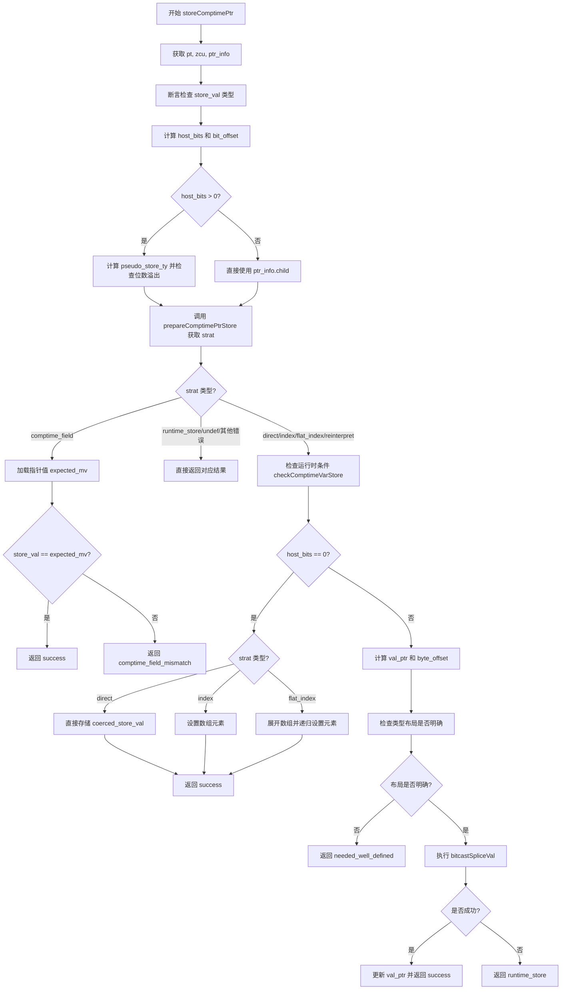

嗯，我需要用Mermaid画出这个Zig函数的流程图。首先，我得理解这个函数的结构。函数名为storeComptimePtr，看起来是处理编译时指针存储的。首先，函数接收sema、block、src、ptr、store_val这些参数，返回一个ComptimeStoreResult。

首先，函数一开始获取了pt和zcu，然后获取ptr的类型信息ptr_info。然后有一个断言，检查store_val的类型是否符合ptr_info的child类型。接下来计算host_bits和bit_offset，这部分涉及不同的情况和目标架构的字节序。可能这里有一些条件分支，比如根据vector_index的不同情况，或者根据endian是大端还是小端。

然后定义pseudo_store_ty，这里有一个条件判断host_bits是否大于0，可能需要处理不同的情况。接着调用prepareComptimePtrStore函数，获取strat策略。根据strat的不同，进入不同的分支处理。比如当strat是.comptime_field时，需要加载指针的值并与store_val比较，如果不匹配则返回错误。

接下来检查是否在运行时条件下，调用checkComptimeVarStore。然后根据host_bits是否为0，处理不同的存储策略，比如direct、index、flat_index等，这里有很多条件分支。如果host_bits不为0，则进行位转换操作，处理val_ptr和byte_offset，最后进行bitcastSpliceVal并更新val_ptr。

我需要将这些步骤分解成流程图中的节点。每个条件判断（如switch语句）对应一个菱形判断节点，不同的case作为分支。函数调用和操作作为矩形节点。可能的返回结果作为结束节点。

需要注意的是，代码中有多个返回点，比如返回.success、.runtime_store等，这些都要在流程图中体现出来。同时，有些分支可能直接返回，而有些会继续执行后续操作。例如，当strat是.comptime_field时，会进行一系列操作后返回，而其他情况可能继续执行后面的代码。

另外，循环部分比如flattenArray和for循环可能需要用循环结构表示，但根据代码中的注释，可能可以简化为一个处理步骤，因为具体实现可能在其他函数中。

可能需要将整个流程分为几个主要部分：初始化、计算host_bits和bit_offset、处理strat的不同情况、检查运行时条件、处理不同存储策略、进行位转换等。每个部分对应流程图中的不同分支。

最后，确保所有可能的路径都被覆盖，包括错误处理和成功返回的情况。
================================================

流程说明：
1. 函数初始化后先进行类型检查和偏移量计算
2. 根据指针策略(strat)分支出多个处理路径：
   - 处理编译时字段的匹配检查
   - 直接处理运行时错误情况
   - 处理不同存储策略（直接/索引/扁平索引/重新解释）
3. 对需要位操作的场景进行类型布局验证和位转换操作
4. 最终通过不同路径返回 11 种可能结果中的对应值
5. 关键判断节点用菱形表示，操作步骤用矩形表示，返回结果用圆角矩形表示