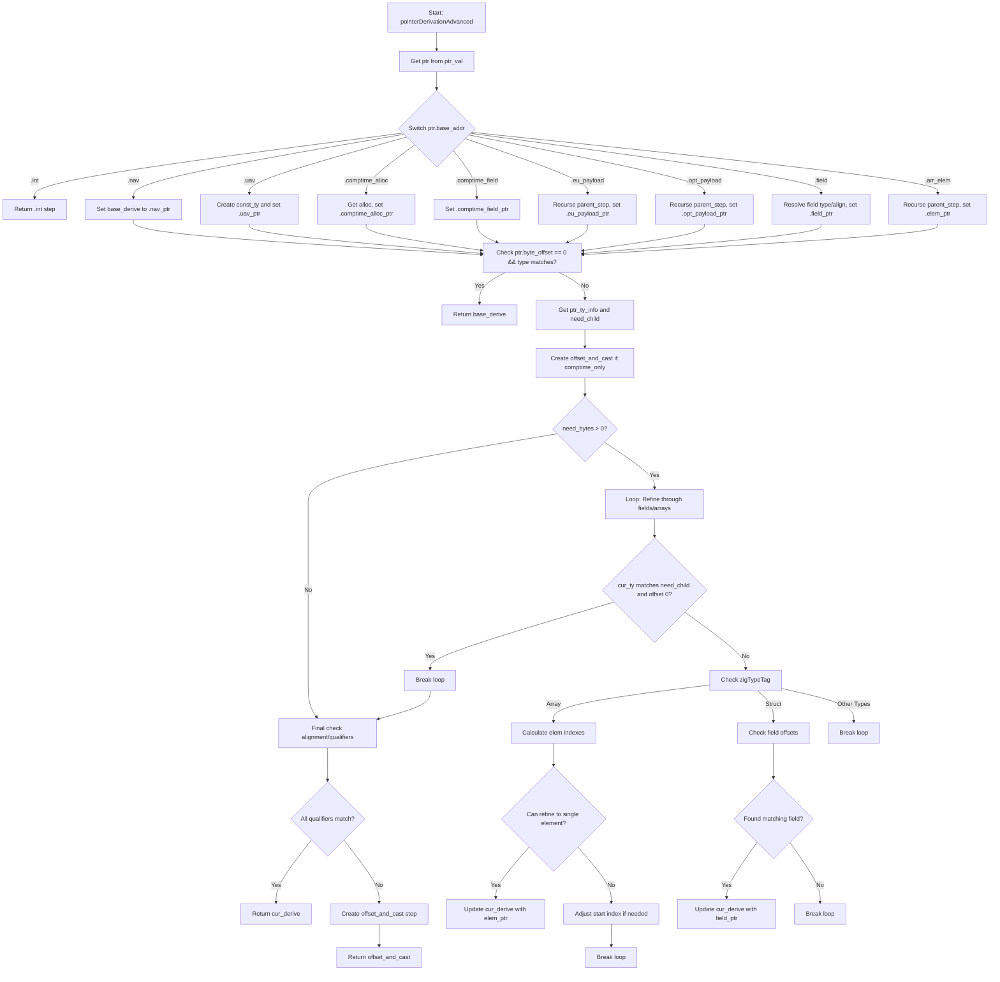

好的，我现在需要帮用户用Mermaid画出一个Zig函数的流程图。这个函数叫做pointerDerivationAdvanced，看起来有点复杂。首先，我需要理解这个函数的结构和逻辑流程。

首先，函数接收几个参数：ptr_val、arena、pt、resolve_types、opt_sema，并返回一个PointerDeriveStep或错误。接下来，函数从zcu中获取ptr的base_addr，然后根据不同的base_addr类型进入不同的分支。比如，.int、.nav、.uav等等，每个分支处理不同的情况，生成不同的base_derive。

然后，函数检查ptr.byte_offset是否为0且类型匹配，如果是的话直接返回base_derive。否则，继续处理指针的类型和偏移量，可能需要通过结构体字段或数组元素进行细化调整，直到无法进一步细化为止。最后，处理偏移和类型转换，返回最终的offset_and_cast步骤。

接下来，我需要将这些逻辑步骤转化为流程图。流程图应该从函数入口开始，然后根据不同的base_addr分支出不同的处理路径。每个分支处理完后，可能会有条件判断，如检查偏移和类型，或者进入循环细化结构体和数组元素。最后，根据条件判断是否需要偏移和类型转换。

需要注意的是，循环部分处理数组和结构体时，可能需要多次迭代调整cur_derive和cur_offset，直到满足退出条件。这部分在流程图中应该表现为一个循环结构，可能用菱形判断框来决定是否继续循环。

另外，条件判断部分，如检查byte_offset是否为0，类型是否匹配，以及是否需要进一步细化，这些都需要在流程图中用判断节点表示。每个判断后的不同路径需要明确标注条件。

可能遇到的难点是如何将复杂的逻辑分支和循环结构清晰地表达出来，同时保持流程图的可读性。需要合理分组和排列各个步骤，避免交叉线过多，导致混乱。

最后，确保所有可能的路径都被覆盖，没有遗漏任何分支，比如所有base_addr的情况，以及细化过程中的各种类型判断和循环退出条件。
================================================
