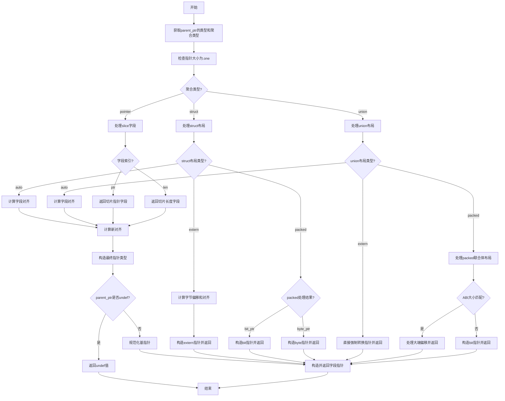

嗯，我需要为这个Zig函数`ptrField`画一个流程图。首先，我需要理解这个函数的结构和逻辑流程。让我先仔细读一遍代码。

函数`ptrField`的参数是`parent_ptr`，`field_idx`，和`pt`。它返回一个`Value`或者错误。函数的主要逻辑是根据`parent_ptr`的类型和字段索引，生成对应的指针类型。

首先，函数获取`parent_ptr`的类型`parent_ptr_ty`，然后获取其指向的聚合类型`aggregate_ty`。接着检查指针的大小是否为`.one`，确保是单个指针。

然后进入一个大的`switch`语句，根据`aggregate_ty`的类型标签（struct、union、pointer等）处理不同的情况。例如，对于结构体，需要考虑不同的布局（auto、extern、packed），计算字段的偏移量和对齐方式，最终构造新的指针类型并返回。

对于联合体，处理方式类似，但需要考虑不同布局下的指针调整。对于指针类型，处理slice的ptr和len字段。

在处理完这些情况后，确定新的对齐方式`new_align`，并构造最终的指针类型`result_ty`。最后处理`parent_ptr`是否为未定义的情况，并构造返回的`Value`。

接下来，我需要将这些逻辑步骤转化为流程图。流程图应该包括开始、结束、判断分支、处理步骤等。特别是大的`switch`结构，需要分支出不同的类型和布局处理。

需要注意各个条件分支，比如`.auto`、`.extern`、`.packed`，以及联合体和指针的不同情况。每个分支内部可能有不同的计算步骤，比如计算偏移量、对齐方式，生成新的指针类型等。

可能还需要处理错误情况，但根据代码中的`try`，错误会向上传递，所以流程图中可能不需要特别标注错误路径，除非有显式的错误处理步骤。

最后，确定所有可能的返回路径，确保每个分支都有明确的出口。

现在，我需要将这些步骤用Mermaid的流程图语法表示出来，确保结构清晰，逻辑正确。
================================================

该流程图按以下逻辑展开：
1. 初始步骤获取类型信息并验证指针大小
2. 根据聚合类型分支处理struct/union/pointer
3. 对struct/extern/packed布局分别处理偏移和对齐逻辑
4. 对union的不同布局处理指针转换规则
5. 对slice类型直接返回预定义的ptr/len字段
6. 统一处理最终对齐方式
7. 处理undef特殊情况和最终指针构造
8. 所有路径最终汇聚到结束节点

关键决策点用菱形节点表示，具体操作步骤用矩形节点，返回操作用圆角矩形表示，保持代码逻辑的层次清晰可见。