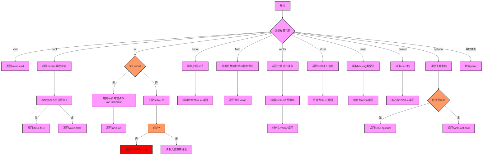

嗯，我现在要帮用户用Mermaid画出他们提供的Zig函数readFromPackedMemory的流程图。首先，我需要理解这个函数的结构和逻辑流程。让我先通读一遍代码，看看它是如何工作的。

函数的名字是readFromPackedMemory，看起来是从打包的内存中读取值，根据不同的类型进行处理。参数包括类型ty、线程相关的pt、缓冲区buffer、位偏移bit_offset和分配器arena。返回的是Value或者错误。

首先，函数根据ty的Zig类型标签进行不同的处理，使用了一个大的switch语句。每个case对应不同的类型，比如void、bool、int、enum、float、vector、struct、union、pointer、optional等。每个类型有不同的处理逻辑。

比如，对于bool类型，它会根据目标架构的大小端来读取相应的字节，然后检查特定位是否为1，返回true或false。对于int类型，分为快速路径（小于等于64位）和慢速路径（大整数），后者需要使用大整数库处理。对于结构体，需要遍历每个字段，递归调用readFromPackedMemory来获取每个字段的值，然后组合成结构体的聚合值。

接下来，我需要把这些逻辑转化为流程图。流程图的开始是函数入口，然后根据类型分不同的分支。每个分支内部可能有更详细的步骤，比如读取字节、处理位运算、处理大整数、递归处理子元素等。

需要注意的是，有些步骤可能会有条件判断，例如int类型中的bits是否小于等于64，这会分出两个子流程。另外，像vector和struct类型需要循环处理每个元素或字段，这时候在流程图中应该用循环结构表示。

还有错误处理，函数可能返回错误IllDefinedMemoryLayout或OutOfMemory，这些应该在流程图中体现出来，比如在分配内存时可能失败，返回错误。

可能需要将整个switch语句的每个case作为一个分支，每个分支内部展开具体的步骤。对于递归调用的情况，比如处理结构体字段时调用自身，这在流程图中可能需要用子流程或者单独的节点表示。

现在，我需要考虑如何用Mermaid的语法来组织这些结构。使用graph TD来定义方向，每个节点用方框，条件判断用菱形，循环可能需要用循环标记或者用条件判断模拟。每个case作为一个分支，连接到相应的处理流程。

例如，对于bool类型的处理，可以分为几个步骤：获取对应的字节，移位操作，判断是否为0，返回true或false。这些步骤可以表示为顺序节点。对于int类型，判断bits是否<=64，分为两个分支，分别处理快速和慢速路径。

在结构体处理中，循环遍历每个字段，每个字段递归调用函数，这可能需要在流程图中用循环结构表示，比如使用循环节点或重复的步骤。

可能还需要处理错误情况，比如arena.alloc可能失败，返回OutOfMemory错误，这时候在流程图中应该有一个错误出口。

总结一下，流程图的大致结构是：

1. 函数开始
2. 判断类型标签
3. 根据类型进入不同的处理分支
4. 每个分支内部处理具体逻辑，可能包含条件判断、循环、递归调用等
5. 处理完成后返回相应的Value
6. 可能的错误路径返回错误

现在需要将这些步骤用Mermaid语法具体化，确保每个分支和子步骤都清晰可见。同时要注意代码中的递归调用如何处理，可能需要用子图或者注释说明。

最后，检查是否有遗漏的分支或处理步骤，比如代码最后的switch的else分支会panic，这也应该在流程图中表示出来。
================================================
