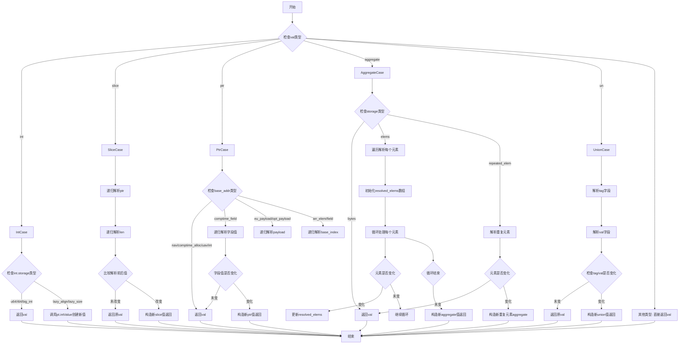

好的，我需要为提供的 Zig 函数 `resolveLazy` 绘制一个流程图。首先，我需要理解这个函数的结构和逻辑流程。

函数的主要结构是一个 `switch` 语句，根据 `val` 的不同类型进行处理。每种类型（如 `int`、`slice`、`ptr` 等）有不同的处理逻辑。我的任务是将这些分支逻辑转化为流程图中的节点和判断步骤。

首先，流程图应该从函数入口开始，然后根据 `val` 的类型进入不同的分支。每个分支内部可能还有进一步的判断或递归调用。例如，处理 `slice` 类型时会递归调用 `resolveLazy` 处理 `ptr` 和 `len`。同样，处理 `ptr` 类型时，根据不同的 `base_addr` 类型有不同的处理方式。

需要注意的是递归调用的情况，比如在处理 `slice`、`ptr` 的某些子字段时，需要再次调用 `resolveLazy`。在流程图中，可能需要用子流程或循环来表示这种递归。

此外，各个分支的最后都会返回一个 `Value`，可能直接返回原值，也可能返回新构造的值。需要确保每个分支的结束点都正确连接到返回步骤。

可能存在一些细节需要注意，比如在处理 `aggregate` 类型时的循环遍历 `elems`，这里需要表示循环结构。还有处理 `un` 类型时对 `tag` 和 `val` 的分别处理。

总结步骤：
1. 确定函数入口。
2. 根据 `val` 的类型分支出不同的处理路径。
3. 对每个类型分支展开其内部逻辑，包括可能的递归调用和条件判断。
4. 处理循环结构（如 `aggregate` 的 `elems`）。
5. 确保所有路径最终汇聚到返回步骤。

需要检查是否有遗漏的分支或未处理的情况，例如 `else => return val` 部分，确保流程图覆盖所有可能性。
================================================
