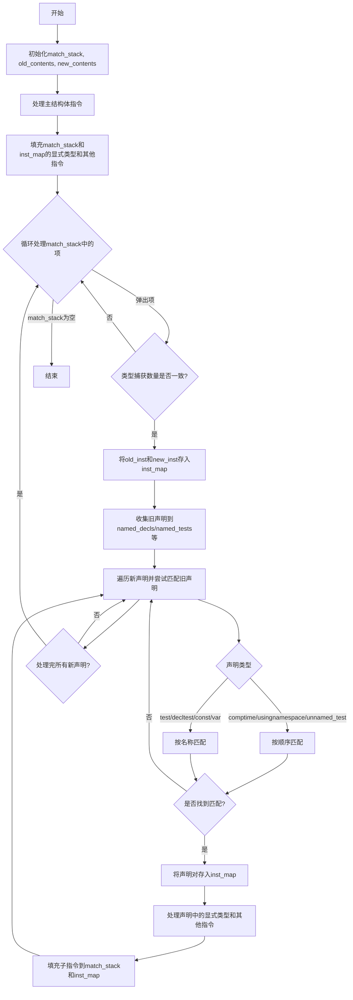

好的，我需要为这个Zig函数`mapOldZirToNew`绘制一个流程图。首先，我需要理解这个函数的作用和结构。看起来这个函数是用来将旧的ZIR（Zig Intermediate Representation）映射到新的ZIR，使用一个指令映射表。函数内部处理了各种声明，比如结构体、联合体、测试等，并通过不同的方式匹配新旧指令。

首先，函数开始初始化一些数据结构，比如`match_stack`来存储匹配的声明，以及`old_contents`和`new_contents`来暂存内容。接着处理主结构体指令，通过比较显式类型和其他指令的数量来填充`inst_map`。然后进入一个循环，处理`match_stack`中的每个匹配项，检查类型捕获的数量是否一致，若不一致则跳过。之后，根据不同的声明类型（如命名声明、测试、comptime块等），尝试匹配旧的和新的声明，并将匹配结果存入`inst_map`。同时，递归处理这些声明中的显式类型和其他指令。

在绘制流程图时，需要分步骤表示这些过程。可能需要多个分支来处理不同类型的声明，循环处理`match_stack`，以及条件判断来确保类型捕获数量一致。此外，需要注意错误处理和资源释放，比如使用`defer`语句释放分配的资源。

现在需要将这些步骤转化为Mermaid的流程图语法。首先确定主要步骤：初始化数据结构，处理主结构体，循环处理匹配项，处理不同类型的声明，递归处理子指令等。然后根据控制流连接这些步骤，包括条件判断和循环。

可能的结构如下：
1. 开始
2. 初始化`match_stack`、`old_contents`、`new_contents`
3. 处理主结构体指令，填充`match_stack`和`inst_map`
4. 进入循环，弹出`match_stack`中的项
5. 检查类型捕获数量，不一致则继续循环
6. 将当前指令对存入`inst_map`
7. 收集旧的各种声明到不同的哈希映射和数组
8. 遍历新声明，尝试匹配旧的声明
9. 根据声明类型，从对应的集合中获取旧的指令索引
10. 若匹配成功，存入`inst_map`，并处理其内容中的显式类型和其他指令，填充到`match_stack`和`inst_map`
11. 继续循环直到`match_stack`为空
12. 结束

在流程图中，需要处理多个条件分支，比如不同类型的声明，以及是否找到匹配项。同时，需要注意递归处理子指令时，如何将新的匹配项推入`match_stack`，从而形成循环。

现在将这些步骤用Mermaid语法表示出来，确保每个判断和操作都正确连接，并处理所有可能的路径。
================================================
