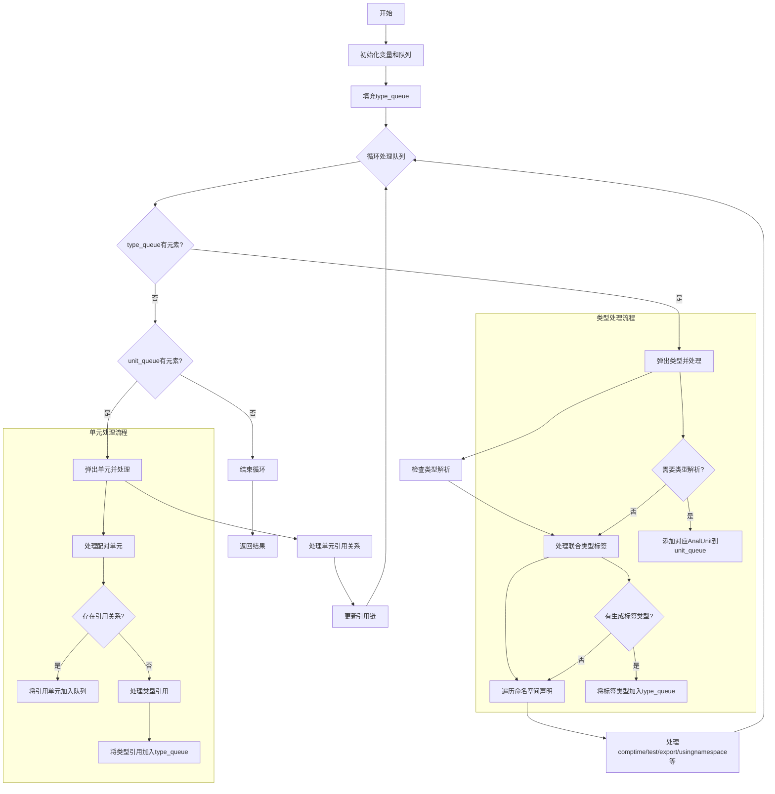

嗯，我需要为这个用 Zig 写的函数 `resolveReferencesInner` 画一个流程图。首先，我得仔细读一遍代码，理解它的结构和逻辑流程。

函数开头声明了一些变量，比如 `result`、`checked_types`、`type_queue` 和 `unit_queue`。然后初始化这些数据结构，并且有错误处理（errdefer）。接下来，它尝试确保 `result` 有足够的容量，处理 `zcu.analysis_roots`，填充 `type_queue`。

之后进入一个大的循环，处理 `type_queue` 和 `unit_queue`。循环内部先处理 `type_queue` 中的类型，检查类型是否需要解析，处理联合类型的标签类型，然后处理命名空间中的各种声明（comptime、test、pub_decls、priv_decls、usingnamespace 等）。之后处理 `unit_queue`，处理单元之间的引用关系，并更新队列。

我需要将这些步骤分解成流程图中的各个节点和判断分支。比如，循环开始时会检查 `type_queue` 是否还有元素，如果有就处理类型相关的逻辑；处理完类型后，再检查 `unit_queue`，处理单元之间的引用。循环直到两个队列都为空为止。

可能需要注意的条件分支包括：是否处理类型解析、是否有生成的标签类型、测试过滤器的判断、是否导出符号等。此外，在处理单元时，还要处理成对的 `nav_val` 和 `nav_ty`。

流程图应该从函数开始，初始化变量，填充初始队列，然后进入主循环，分情况处理类型队列和单元队列，处理各自的逻辑，更新队列，直到队列为空，最后返回结果。

需要确保所有的条件判断和循环都正确反映在流程图中，比如 `if (has_resolution)`、`if (tag_ty != .none)`、各种 `for` 循环遍历声明，以及队列的弹出和压入操作。

可能还需要处理错误情况，但由于函数使用 `try` 和错误联合返回，流程图可能不涉及错误处理的具体路径，除非有显式的错误分支。

最后，需要确认各个步骤之间的连接是否正确，尤其是循环内的分支和队列处理。可能需要使用条件判断节点来表示不同的处理路径，比如处理类型队列还是单元队列，或者是否满足某些条件进入特定的处理逻辑。
================================================
