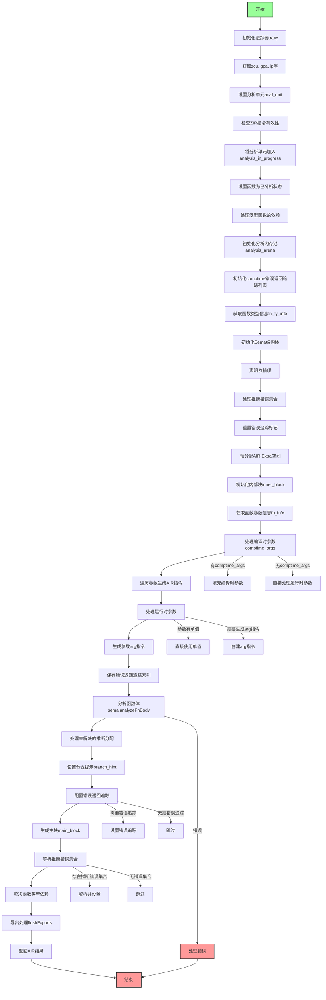

好的，我需要为给定的Zig函数`analyzeFnBodyInner`绘制一个流程图。首先，我需要理解这个函数的主要逻辑和各个步骤。这个函数看起来是用于分析函数体内部的语义，生成对应的中间表示（Air）。让我逐步分析代码的结构和流程。

首先，函数开始时会进行一些初始化操作，比如获取跟踪器、从Zcu中获取必要的信息、处理函数体指令等。接着，它会设置分析单元，处理泛型函数的情况，并初始化Sema结构体，用于语义分析。然后，处理参数，生成对应的AIR指令，包括处理编译时参数和运行时参数。之后，进行错误跟踪的设置，分析函数体，处理未解决的分配，设置分支提示，处理错误返回跟踪，最后生成主块并解决推断的错误集合，最终返回生成的AIR指令和额外数据。

接下来，我需要将这些步骤转化为流程图中的各个节点和判断分支。需要注意的条件包括是否泛型函数实例、是否有编译时参数、错误处理的情况等。每个主要操作如初始化Sema、处理参数、分析函数体等都应作为流程中的步骤。错误处理和资源释放（如defer语句）也需要在流程图中体现。

需要确认各个条件分支的位置，例如处理编译时参数时的循环、错误返回跟踪的设置是否必要等。同时，确保流程图的连贯性，正确反映函数的执行顺序和可能的路径。

最后，根据分析的结果，使用Mermaid语法绘制出流程图，确保每个步骤和条件分支都正确表示，并使用合适的符号（如矩形表示步骤，菱形表示判断）。
================================================
