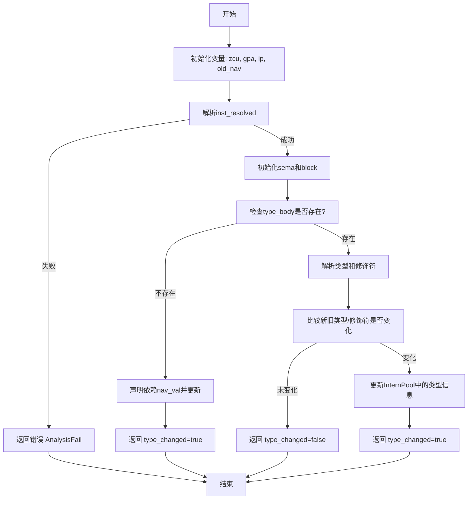

嗯，我现在要帮用户用Mermaid画一个函数的流程图。这个函数是Zig语言写的，看起来是关于分析导航类型的。首先，我需要理解这个函数的结构和逻辑流程。

首先，函数名是analyzeNavType，参数是pt和nav_id，返回一个结构体包含type_changed布尔值。开始部分定义了一些变量，比如zcu、gpa、ip，然后获取旧的nav信息。接着检查inst_resolved，处理文件相关的信息，初始化一些结构如analysis_arena和sema。然后进入块（block）的处理，处理zir_decl的类型体，解析类型，处理修饰符，最后比较新旧类型是否有变化，如果有变化就更新ip中的信息，返回type_changed为true，否则false。

我需要把这些步骤分解成流程图中的各个节点。可能的步骤包括：初始化变量，获取旧nav，检查inst_resolved，处理文件，初始化sema，声明依赖，处理块，解析类型体，处理修饰符，比较变化，更新ip，返回结果。需要注意的是条件判断，比如是否有type_body，以及changed的判断逻辑。

在画流程图时，需要处理条件分支，例如当type_body存在与否时的不同处理路径。另外，错误处理和defer语句可能需要表示，但流程图可能更关注主流程。还有在处理changed时，根据旧状态的不同进行比较，这部分可能有多个条件分支。

可能的结构是：开始→初始化变量→获取旧nav→解析inst_resolved→处理文件→初始化sema和块→检查type_body是否存在→如果不存在，声明依赖，更新navVal→返回type_changed为true→如果存在，解析类型和修饰符→比较新旧是否变化→如果变化则更新ip→返回相应的结果。

需要注意的是函数中的多个条件判断，如是否有type_body，以及changed的不同情况。这些都需要在流程图中用菱形判断框表示分支。同时，错误处理部分可能作为单独的分支，比如返回error.AnalysisFail的情况，但用户可能只需要主流程，所以可以简化。

现在我需要将这些步骤转化为Mermaid的流程图语法，确保逻辑顺序正确，条件分支清晰。可能需要使用不同的节点形状，如矩形表示步骤，菱形表示判断，箭头表示流程方向。确保每个判断点都有两个或多个出口，对应不同的处理路径。

总结步骤：
1. 开始
2. 初始化变量（zcu, gpa, ip等）
3. 获取old_nav
4. 解析inst_resolved，若失败返回错误
5. 处理文件，初始化sema和块
6. 检查type_body是否存在
   - 不存在：声明依赖，确保navVal更新，返回type_changed=true
   - 存在：解析类型和修饰符，比较变化
7. 根据changed的值决定是否更新ip
8. 返回相应的type_changed值

在流程图中，需要将每个主要步骤作为节点，条件判断作为分支。可能还需要处理错误情况，但用户可能只关心主流程，所以可能忽略错误处理部分，或简要提及。

现在尝试用Mermaid语法画出这个流程。
================================================

流程图说明：
1. **主流程**从左到右执行，条件判断用菱形表示。
2. 当`type_body`不存在时直接触发依赖更新并返回类型变化。
3. 当`type_body`存在时解析类型/修饰符，通过多条件比较判断是否需要更新。
4. 所有路径最终汇聚到结束节点。