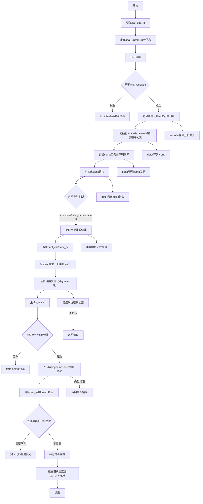

嗯，我需要为这个Zig函数画一个流程图。首先，我得仔细读一下代码，理解它的主要步骤和逻辑结构。这个函数名为analyzeNavVal，看起来是用于分析某个导航值（nav_val）的，可能涉及类型检查、依赖处理、错误处理等。

首先，函数开始获取一些上下文，比如zcu、gpa、ip。然后定义了一个anal_unit，记录旧的nav信息，接着进行日志输出。然后尝试解析inst_resolved，如果失败则返回错误。之后将当前分析单元加入analysis_in_progress，确保在出错时能移除。

接下来，初始化分析用的内存分配器（analysis_arena），以及处理错误的跟踪列表（comptime_err_ret_trace）。然后创建了sema实例，这可能是一个语义分析的结构，负责后续的类型检查和语义分析。在sema的初始化中，还声明了依赖项，确保后续步骤能正确处理依赖关系。

之后，处理块（block）的初始化，并根据不同的声明类型（如const、var、usingnamespace等）进行不同的处理。比如，处理类型体（type_body）、值体（value_body），并解析最终的val和ty。这里有很多条件分支，需要特别注意不同情况下的处理流程。

在处理完类型和值之后，还需要处理链接器相关的属性，如alignment、linksection、addrspace等。这部分可能涉及到目标平台的特定检查，比如某些平台不支持函数对齐。

然后，根据不同的声明类型和链接属性，生成最终的nav_val，并进行错误检查。特别是对于usingnamespace的情况，需要确保类型正确且有命名空间。

最后，处理导出（export）和代码生成（codegen），根据条件决定是否将工作加入队列。最终根据旧nav的状态返回val_changed的结果。

在画流程图时，需要将上述步骤模块化，用不同的节点表示各个阶段，如初始化、依赖处理、类型解析、值解析、错误检查、导出处理等。分支条件如不同的声明类型、是否含有type_body或value_body、不同的链接属性等，需要用条件判断节点来连接。

需要注意错误处理路径，比如errdefer的使用，以及在各个可能出错的地方返回错误。此外，循环或递归的部分（如果有的话）也需要表示出来，但在这个函数中似乎没有明显的循环，主要是条件分支。

可能还需要注意函数的结束部分，比如defer语句释放资源，以及最终的返回结果判断。对于流程图中的并发或异步处理（如队列任务），也需要适当表示。

总结一下，流程图的大致结构可能如下：

1. 初始化和资源准备
2. 解析inst_resolved，失败则返回错误
3. 将分析单元加入进行中列表
4. 初始化sema和block结构
5. 处理类型和值的解析（有条件分支）
6. 处理链接器属性（有条件分支）
7. 生成nav_val并进行错误检查
8. 处理usingnamespace特殊情况
9. 处理导出和代码生成队列
10. 根据旧状态返回结果

每个步骤中的条件分支需要详细展开，比如不同类型的声明处理、是否含有type_body等。确保所有可能的路径都被覆盖，并且错误处理路径正确连接。
================================================

该流程图的主要特点：
1. 使用条件分支处理不同声明类型（const/var/usingnamespace）
2. 包含详细的错误处理路径（红色虚线框表示错误返回）
3. 突出显示关键操作：依赖声明、类型解析、值生成、链接属性处理
4. 使用子流程表示复杂操作（如类型/值解析）
5. 包含内存管理操作（arena/sema/block的资源释放）
6. 最终根据新旧状态对比返回结果
7. 特殊处理usingnamespace和导出逻辑

每个菱形节点代表关键决策点，矩形节点代表具体操作步骤，椭圆形表示开始/结束节点。