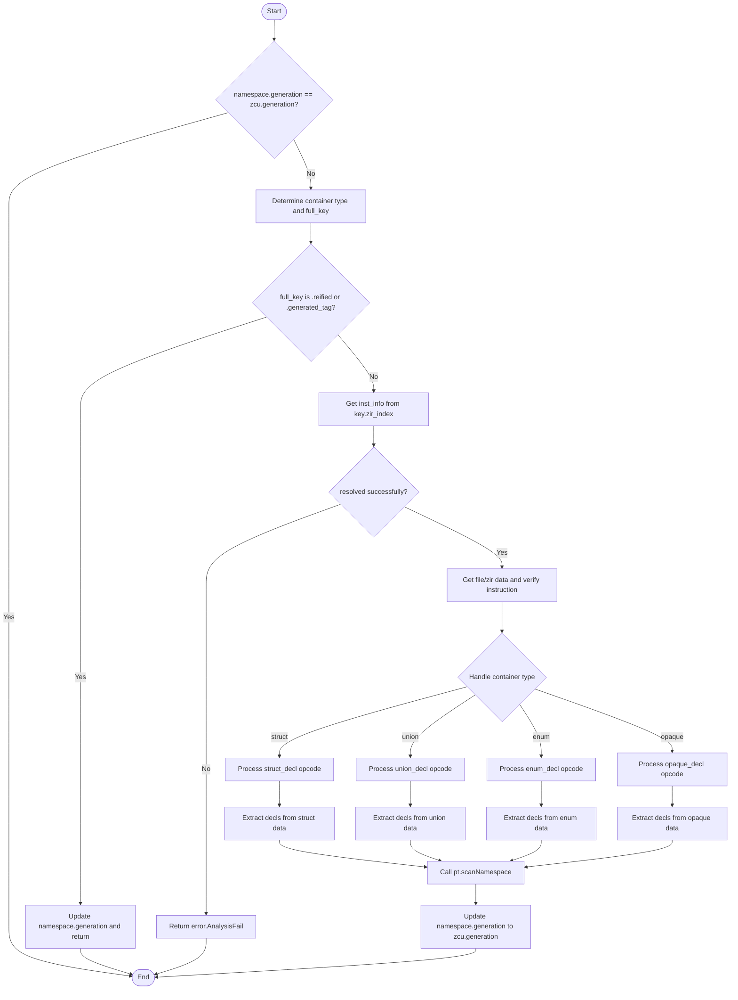

嗯，我现在需要为一个用Zig编写的函数生成流程图。这个函数叫做ensureNamespaceUpToDate，属于Zcu.PerThread模块。首先，我得仔细阅读代码，理解它的逻辑结构，然后才能画出正确的流程图。

首先，函数开始的时候，检查namespace的generation是否等于zcu的generation。如果相等的话就直接返回，否则继续处理。这应该是一个判断条件，流程图中的菱形判断框。

接下来，代码里定义了一个Container枚举，包含struct、union、enum、opaque四种类型。然后根据namespace.owner_type的类型，决定container和full_key的值。这里可能是一个switch语句，对应不同的类型，所以可能需要多个分支。

然后，根据full_key的情况，如果是reified或generated_tag，就将namespace的generation更新并返回。否则，继续处理declared的情况。这里又是一个判断，可能需要另一个菱形框。

接下来，获取inst_info，如果解析失败就返回错误。然后获取file和zir，接着断言检查指令的tag是否为.extended，并获取extended数据。这部分可能对应一些操作步骤，比如解析数据、获取文件信息等。

之后，根据container的类型（struct、union、enum、opaque），分别处理不同的情况，提取decls。每个容器类型的处理逻辑不同，比如struct需要处理small、extra数据，计算extra_index，最终得到decls。这些不同的情况应该对应不同的分支处理流程。

处理完decls后，调用pt.scanNamespace方法，并更新namespace的generation。最后结束流程。

现在，我需要将这些步骤转化为流程图。首先，开始节点，然后检查namespace.generation是否等于zcu.generation，如果是的话直接结束。否则，进入不同的容器类型处理分支。对于每个容器类型，可能有不同的处理步骤，比如处理struct_decl、union_decl等。然后根据full_key的类型判断是否需要提前返回，或者继续处理declared的情况。接着解析inst_info，获取zir数据，处理不同的容器类型，提取decls，最后调用scanNamespace并更新generation。

需要注意的是，每个容器类型（struct、union、enum、opaque）可能有不同的处理流程，这些应该在流程图中用不同的分支表示。此外，错误处理（如返回error.AnalysisFail）也需要在流程图中体现。

可能需要使用子流程或者分页来处理不同容器类型的详细步骤，以保持流程图的可读性。或者，可以将公共步骤合并，只在分支处区分不同的处理逻辑。比如，处理struct和union时，虽然具体步骤不同，但整体结构类似，可以统一描述，再在分支中详细说明差异。

另外，代码中的变量声明和赋值操作，比如const zcu = pt.zcu;，可能不需要在流程图中单独表示，除非它们影响流程的判断或分支。流程图的重点是控制流，而不是所有变量的细节。

总结一下，流程图的步骤大致如下：

1. 开始
2. 检查namespace.generation是否等于zcu.generation，是则结束。
3. 否则，确定container类型（struct/union/enum/opaque）和full_key。
4. 根据full_key的类型判断是否是reified/generated_tag，如果是则更新generation并返回。
5. 否则，处理declared的情况，获取inst_info，如果失败则返回错误。
6. 根据container类型处理不同的情况，提取decls。
7. 调用scanNamespace，更新generation，结束。

现在，我需要用Mermaid语法将这些步骤绘制出来。需要注意的是，Mermaid的流程图语法支持条件判断、子程序、并行处理等。对于不同的容器类型处理，可能需要使用不同的分支，或者使用子图来表示每个类型的处理流程。

不过，由于代码中处理不同容器类型的逻辑较为复杂，每个容器类型内部有很多步骤，直接全部展开可能会导致流程图过于庞大。因此，可能需要将每个容器类型的处理简化为一个步骤，比如“处理struct的decls提取”，而具体的细节可以在子流程中展开，或者用注释说明。

此外，错误处理路径也需要考虑，比如当resolveFull返回null时，返回error.AnalysisFail。

最终，流程图的结构可能如下：

开始 -> 检查generation是否最新？
是 -> 结束
否 -> 确定container类型和full_key
-> 检查full_key是否是reified/generated_tag？
是 -> 更新generation并返回
否 -> 获取inst_info，解析失败则返回错误
-> 根据container类型处理，提取decls
-> 调用scanNamespace
-> 更新generation
-> 结束

在Mermaid中，可以用菱形表示判断，矩形表示步骤，箭头表示流程方向。对于不同的容器类型处理，可能需要使用多个条件分支，或者用一个大的判断框，根据container类型进入不同的处理子流程。

不过，考虑到代码中每个容器类型的处理都是通过switch语句分开的，可能需要为每个类型绘制单独的处理路径，或者将它们合并为一个步骤，注明不同的处理逻辑。

可能最终的Mermaid流程图会包含多个条件判断和分支，每个分支对应不同的容器类型和情况。
================================================

该流程图完整展示了函数的执行逻辑：
1. 首先检查命名空间版本，如果已最新则直接结束
2. 确定容器类型并检查full_key类型，若为轻量类型则直接更新版本
3. 对于需要深入解析的类型：
   - 解析ZIR指令信息
   - 根据容器类型（struct/union/enum/opaque）执行不同的声明提取逻辑
   - 最终统一调用scanNamespace扫描命名空间
4. 所有路径最终都会更新命名空间版本并结束流程
5. 错误处理路径单独标出以保证鲁棒性

每个容器类型的详细解析步骤在代码中通过不同的ZIR指令处理实现，流程图中使用子分支表示这些差异化的处理逻辑。