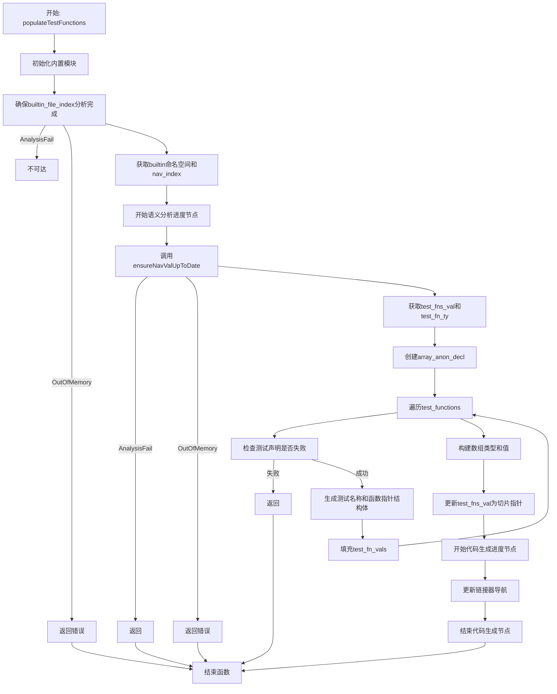

嗯，我现在需要为这个用Zig写的函数`populateTestFunctions`画一个流程图。首先，我得仔细读一下这段代码，理解它的结构和各个步骤之间的逻辑关系。

首先，函数接收两个参数：`pt`和`main_progress_node`。看起来`pt`是一个`Zcu.PerThread`的实例，而`main_progress_node`是用于进度跟踪的节点。接下来，函数开始处理一些内置模块的依赖，比如获取`builtin_mod`和`builtin_file_index`，然后确保文件分析完成。这里可能会有错误处理，比如如果分析失败或者内存不足，会进行相应的处理。

然后，代码进入了一个块，调用`ensureNavValUpToDate`来更新导航值，这里涉及到了进度节点的开始和结束，应该是在跟踪语义分析的进度。这部分需要注意错误处理的情况，比如`AnalysisFail`和`OutOfMemory`。

接下来，函数获取`test_fns_val`和`test_fn_ty`，这两个变量可能与测试函数相关的类型和值有关。然后是一个名为`array_anon_decl`的块，其中创建了一个匿名数组声明，并填充了测试函数的值。这里循环遍历`zcu.test_functions`，为每个测试函数生成名称和函数指针，并将它们组合成结构体，存储在数组中。

之后，处理数组类型和值，构建一个指向该数组的切片指针，并更新`test_fns_val`的初始值。最后，进入代码生成阶段，更新链接器的导航信息，并结束代码生成的进度节点。

现在需要把这些步骤转化为流程图。流程图通常包括开始、结束、处理步骤、判断和循环结构。需要注意各个步骤之间的顺序和可能的错误路径。例如，在分析`builtin_file_index`时，可能遇到错误，这时候需要处理错误并返回。同样，在`ensureNavValUpToDate`时也可能出现错误。

可能的结构：

1. 开始：函数入口。
2. 初始化内置模块：获取`builtin_mod`，`builtin_file_index`。
3. 确保文件分析完成：调用`pt.ensureFileAnalyzed`，处理可能的错误。
4. 获取命名空间和导航索引。
5. 开始语义分析进度节点，调用`ensureNavValUpToDate`，处理错误。
6. 获取测试函数的值和类型。
7. 创建匿名数组声明，循环处理每个测试函数：
   a. 检查分析是否失败，如果是，返回。
   b. 生成测试名称和函数指针的结构体字段。
8. 构建数组类型和值。
9. 更新`test_fns_val`的初始值为新的切片指针。
10. 开始代码生成进度节点，更新链接器导航，结束进度节点。
11. 结束函数。

在流程图中，需要表示这些步骤的顺序，循环处理每个测试函数，以及可能的错误处理分支。例如，在步骤3和步骤5中，如果出现错误，流程会提前返回。

另外，需要注意各个块的作用域，比如使用`{ ... }`包裹的部分，可能对应流程中的子步骤或临时作用域。例如，在构建`array_anon_decl`时，内部有一个循环填充`test_fn_vals`，这应该用循环结构表示。

可能的错误处理分支需要单独的分支箭头，例如在`ensureFileAnalyzed`中如果出现`OutOfMemory`错误，直接返回错误；而`AnalysisFail`则不可达。同样，在`ensureNavValUpToDate`中遇到错误则返回。

最后，代码生成阶段完成后结束整个流程。
================================================

流程图说明：
1. 从函数入口开始初始化内置模块
2. 通过三个菱形节点处理潜在错误路径(内存不足/分析失败)
3. 语义分析阶段包含进度节点管理和关键方法调用
4. 核心逻辑在数组创建部分，使用循环结构处理每个测试函数
5. 对每个测试函数进行失败检查的决策分支
6. 最终完成数组构建后更新全局值并进入代码生成阶段
7. 所有路径最终收敛到函数结束节点
8. 使用垂直布局保持代码执行顺序的可视化一致性