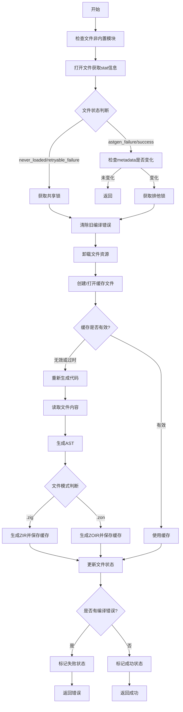

嗯，我需要用Mermaid来画这个Zig函数的流程图。首先，我得仔细读一下这个updateFile函数，理解它的逻辑结构。函数看起来是用来更新文件的，涉及到缓存处理、文件锁定、生成ZIR/ZOIR代码等步骤。

首先，函数开始的时候，会检查文件是否是内置模块，然后打开文件获取stat信息。接着根据文件的状态（如never_loaded, retryable_failure等）决定是获取共享锁还是排他锁。然后处理旧有的编译错误，可能需要保存之前的ZIR数据。之后卸载当前的文件资源，尝试创建或打开缓存文件。如果缓存有效，就直接使用，否则需要重新生成AST和ZIR/ZOIR代码，并保存到缓存中。最后根据生成结果更新文件状态，处理可能的编译错误。

接下来，我需要把这些步骤分解成流程图中的各个节点。可能的分支包括文件状态判断、缓存是否有效、是否需要更新缓存、生成代码的成功或失败等。需要注意条件判断和循环结构，比如创建缓存文件时的重试逻辑。

可能的结构：

1. 开始 -> 检查文件状态
2. 根据状态获取锁类型（共享或排他）
3. 清除旧的编译错误
4. 卸载当前文件资源
5. 尝试打开缓存文件
6. 判断缓存是否有效
   - 有效：直接使用缓存
   - 无效或过时：重新生成代码并保存到缓存
7. 更新文件状态和统计信息
8. 处理编译错误，设置成功或失败状态
9. 结束

需要处理的条件分支，例如缓存检查的结果（success, invalid, truncated, stale），以及不同的文件模式（.zig和.zon）生成不同的代码。还有错误处理的部分，比如文件读取失败或写入缓存失败的情况。

可能需要用菱形表示判断节点，矩形表示处理步骤，箭头连接流程。要注意循环部分，比如在创建缓存文件时可能的重试逻辑。另外，函数中有一些错误处理，如文件锁失败、缓存目录被删除等，这些是否需要在流程图中体现？

可能先画出主流程，再处理错误分支。不过由于流程图可能过于复杂，可以适当简化，只保留主要步骤和关键判断点，避免过于细节的错误处理。

最后，根据上述分析，用Mermaid语法将各个步骤和判断连接起来，形成完整的流程图。
================================================
