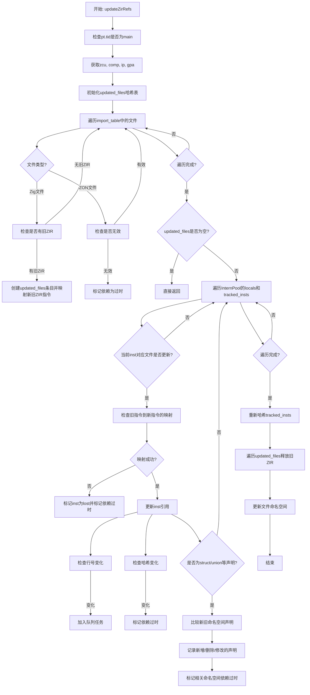

嗯，用户希望我用Mermaid画出这个Zig函数的流程图。首先，我需要仔细理解这个函数的结构和逻辑。这个函数叫做updateZirRefs，属于PerThread模块。看起来它的主要作用是更新ZIR（Zig Intermediate Representation）的引用，处理文件的变化，并相应地标记依赖项为过时。

首先，我会通读整个函数，分步骤理清流程。函数开始检查pt.tid是否是主线程，然后获取一些上下文变量，比如zcu、comp、ip、gpa。接下来，初始化了一个updated_files的哈希映射，用来记录更新的文件信息。然后，遍历zcu的import_table，处理每个文件。对于Zig文件，如果旧ZIR存在，则进行新旧ZIR的映射；对于ZON文件，如果有变动则标记依赖为过时。

接着，如果updated_files中没有文件更新，直接返回。否则，遍历InternPool中的locals，处理每个跟踪的指令。对于每个tracked_inst，检查对应的文件是否在updated_files中。如果旧指令无法映射到新指令，标记为lost并标记依赖过时。如果能找到新指令，则更新引用，并检查是否有行号变化或哈希变化，触发相应的队列任务或依赖失效。

然后，处理具有命名空间的结构体声明，比较新旧ZIR中的声明，记录变化，并标记相关依赖。最后，重新哈希跟踪的指令，释放旧ZIR资源，并更新文件的命名空间。

在画流程图时，需要将这些步骤模块化，用不同的节点表示条件判断、循环、函数调用等。需要注意的是，循环结构（如遍历import_table、locals、declIterator等）需要用循环节点表示。条件判断如文件类型、是否找到映射等，需要用菱形判断节点。

可能遇到的难点是如何正确表达嵌套的循环和条件判断，尤其是处理哈希映射和数组遍历的部分。需要确保每个步骤之间的流程清晰，逻辑正确。另外，注意处理错误和资源释放的部分，比如defer语句中的清理操作，是否在流程图中体现。

总结一下，流程图的大致结构可能是这样的：

1. 函数入口，检查tid是否为main。
2. 初始化变量和updated_files。
3. 遍历import_table，处理每个文件：
   a. 如果是ZON文件且无效，标记依赖。
   b. 如果是Zig文件且有旧ZIR，映射新旧ZIR到updated_files。
4. 如果没有更新文件，结束。
5. 遍历InternPool的locals和tracked_insts：
   a. 检查文件是否在updated_files中。
   b. 处理旧指令到新指令的映射，失败则标记lost。
   c. 检查行号变化，队列任务。
   d. 检查哈希变化，标记依赖。
   e. 处理命名空间变化，比较新旧声明，标记相关依赖。
6. 重新哈希tracked_insts。
7. 处理每个更新文件，释放旧ZIR，更新命名空间。

在绘制时，要确保这些步骤以正确的顺序和条件连接起来，使用合适的Mermaid语法表示流程。
================================================

流程说明：
1. 函数入口检查线程ID有效性
2. 初始化关键数据结构和哈希表
3. 分类型处理导入文件：
   - Zig文件执行ZIR指令映射
   - ZON文件处理失效状态
4. 若无更新直接返回
5. 深度遍历所有跟踪指令：
   - 处理指令映射失败场景
   - 检测行号/哈希值变化
   - 处理复杂类型的命名空间变更
6. 最后执行资源清理和命名空间更新
7. 所有路径最终汇聚到结束节点