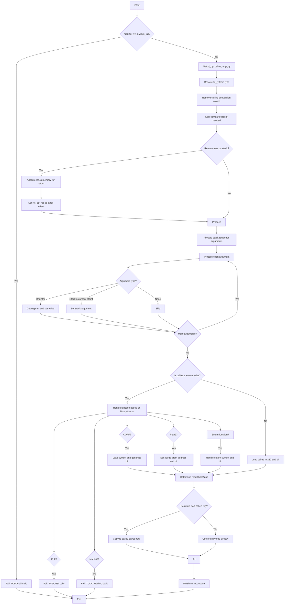

嗯，我需要为这个Zig函数`airCall`画一个流程图。首先，我得仔细看一下代码的结构，理解每个步骤的作用。函数看起来是处理AArch64架构的函数调用生成，涉及参数传递、寄存器管理、调用约定等。

首先，函数开始检查是否为尾部调用（tail call），如果是的话就返回错误，因为还没有实现。接着获取调用相关的操作数和参数，解析调用约定信息。然后处理返回值的位置，可能是在栈上分配空间。接下来处理参数传递，包括寄存器和栈上的参数。然后根据不同的二进制文件格式（ELF、Mach-O、COFF等）生成不同的调用指令。最后处理返回值，并完成后续的清理工作。

我需要将这些步骤分解成流程图中的各个节点。可能的分支包括不同的调用约定处理、不同的二进制文件格式处理、以及返回值的不同情况。另外，错误处理和资源释放（如`info.deinit`）也需要考虑进去。

需要注意的是，流程图中需要体现条件判断，比如`modifier == .always_tail`，`info.return_value`的类型，以及不同的二进制文件类型判断。每个条件分支应该对应不同的处理路径。

可能的结构是：

1. 开始
2. 检查尾部调用，如果是则失败
3. 获取调用操作数和参数
4. 解析调用约定信息
5. 保存比较标志（如果需要）
6. 处理返回值（栈分配或寄存器）
7. 分配栈空间给参数
8. 处理每个参数（寄存器或栈）
9. 根据callee的类型生成调用指令（ELF、Mach-O、COFF等）
10. 处理返回值结果
11. 完成Air指令，返回结果

每个步骤中的条件判断需要用菱形节点表示，分支到不同的处理流程。例如，处理返回值时，如果是栈偏移，则分配内存；否则继续。处理参数时，根据参数的位置（寄存器、栈等）有不同的操作。

另外，代码中有多个错误处理路径，比如`fail`函数调用，这些也需要在流程图中体现，可能作为终止节点或错误出口。

最后，生成的流程图需要结构清晰，逻辑正确，覆盖所有主要分支和步骤。
================================================
