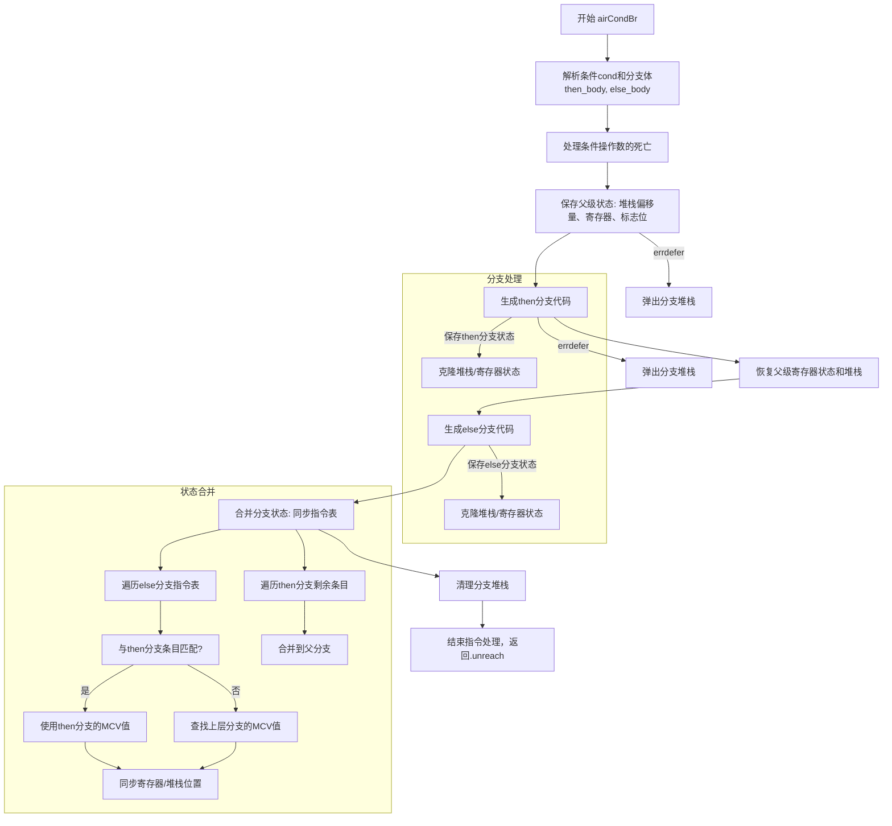

好，我现在需要为给定的Zig函数`airCondBr`绘制流程图。首先，我得仔细阅读代码，理解它的结构和逻辑流程。

首先，函数开始处理条件分支指令。它解析条件操作数，获取then和else分支的指令体。然后处理条件死亡，如果条件操作数在此处死亡，就进行相应的处理。接下来保存当前的寄存器、堆栈状态，以便后续恢复。

然后生成then分支的代码，完成后恢复之前保存的状态，处理else分支的代码。之后需要合并两个分支的结果，确保寄存器和堆栈状态一致。最后清理资源，结束指令处理。

接下来，我需要将这些步骤分解成流程图中的各个节点。可能的步骤包括：

1. 解析条件和分支体。
2. 处理条件操作数的死亡。
3. 保存父级状态（寄存器、堆栈）。
4. 生成then分支代码。
5. 恢复父级状态。
6. 生成else分支代码。
7. 合并两个分支的状态。
8. 清理分支堆栈。
9. 完成指令处理，返回结果。

需要注意条件判断和状态恢复的逻辑，以及异常处理部分（如errdefer）。此外，合并分支状态时可能需要处理冲突，确保寄存器分配的一致性。

需要确认每个步骤的顺序和可能的条件分支，比如是否有错误处理路径。不过在这个函数中，错误处理似乎通过errdefer来捕获，所以在流程图中可能不需要单独的分支，而是作为步骤的一部分。

最后，用Mermaid的流程图语法将这些步骤连接起来，确保逻辑正确，步骤清晰。
================================================
