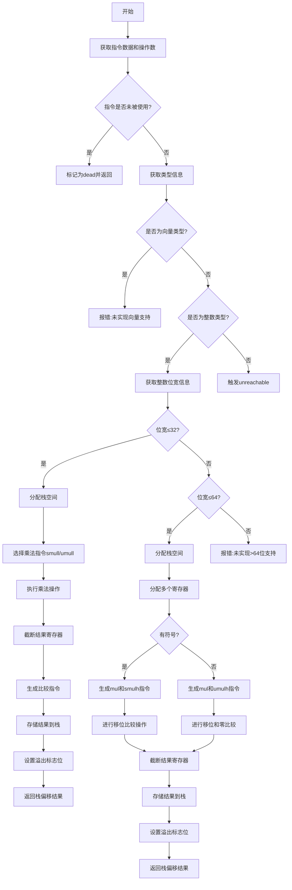

好的，我需要为提供的Zig函数`airMulWithOverflow`绘制流程图。首先，我需要理解这个函数的功能和结构。这个函数处理带有溢出的乘法操作，针对AArch64架构生成机器码。

首先，函数开始处获取指令的数据类型和操作数。如果当前指令未被使用，则标记为dead并返回。接着，根据操作数的类型（向量或整数）进行不同的处理。对于整数类型，分为小于等于32位和小于等于64位的情况，以及更大的整数（尚未实现）。

对于32位及以下的整数，函数使用`smull`或`umull`指令进行乘法，然后截断结果并比较是否溢出，最后将结果和溢出位存储在栈上。对于64位整数，处理更复杂，涉及多个寄存器的分配和使用，包括高位乘法指令（如`smulh`、`umulh`），移位操作和比较，以检测溢出。

我需要将这些逻辑步骤转化为流程图中的各个节点和判断分支。可能的节点包括：检查指令是否被使用、确定整数位数、处理32位及以下的情况、处理64位的情况、处理有符号和无符号的不同路径、分配寄存器、生成机器指令、设置栈上的结果等。判断分支包括整数位数、符号类型、是否需要移位等。

需要注意流程中的条件判断，如`int_info.bits <= 32`、`int_info.signedness`等，这些将作为分支点。此外，错误处理和未实现的部分（如向量和大于64位的整数）也需要在流程图中体现。

最后，确保流程图的逻辑顺序正确，各步骤之间的转换清晰，并使用合适的Mermaid语法表示。
================================================
