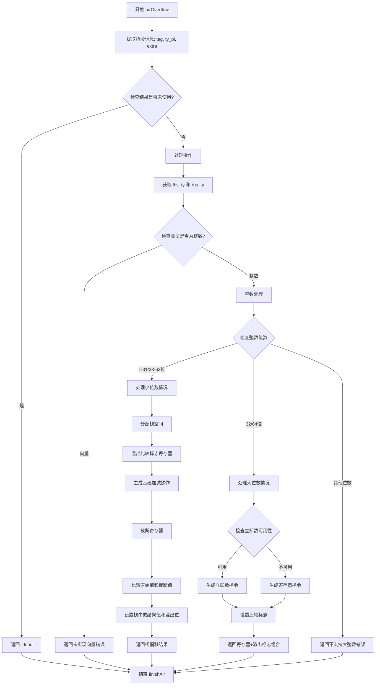

好的，我需要帮助用户理解如何将提供的 Zig 代码函数 `airOverflow` 转换为流程图。首先，我需要仔细阅读代码，理解其结构和逻辑流程。

函数 `airOverflow` 处理带有溢出的加法和减法操作。首先，它从指令中提取标签、类型和额外数据。然后根据操作数类型（如整数或向量）进行不同的处理。对于整数，分为不同位数的情况（1-31、33-63位和32、64位），处理方式也不同。对于某些情况，会生成机器码指令，处理溢出标志，并将结果存储在栈或寄存器中。

接下来，我需要确定流程图的主要分支和步骤。可能的步骤包括：

1. 函数开始，提取指令信息。
2. 检查结果是否未使用，直接标记为.dead。
3. 处理向量类型，返回未实现错误。
4. 处理整数类型，根据位数分情况处理：
   a. 1-31或33-63位：分配栈空间，处理加减操作，截断寄存器，比较结果，设置栈中的值和溢出位。
   b. 32或64位：处理立即数或寄存器操作，生成对应机器指令，处理溢出标志。
5. 返回结果，结束指令处理。

需要注意条件判断，比如整数位数、是否立即数、操作类型（add/sub）等。此外，错误处理（如未实现的功能）也需要在流程图中体现。

现在需要将这些步骤转化为 Mermaid 的流程图语法，确保逻辑清晰，分支正确。可能需要使用不同的节点表示判断、操作、错误处理等，并用箭头连接各步骤。
================================================
