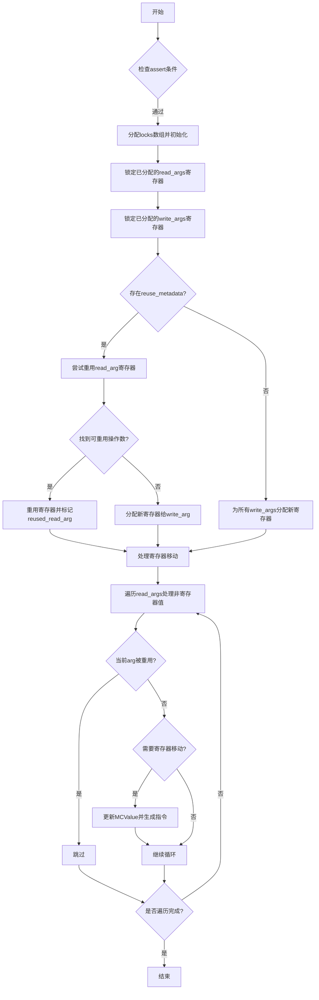

嗯，我需要帮用户用Mermaid画出这个Zig函数的流程图。首先，我得仔细读一遍这个函数的代码，理解它的逻辑结构。这个函数叫做allocRegs，看起来是处理寄存器分配的，涉及到读取参数（read_args）和写入参数（write_args），还有一些重用的元数据（reuse_metadata）。

首先，函数开始有两个assert语句，检查reuse_metadata存在时的一些条件。然后是分配锁（locks）数组，分为read_locks和write_locks，用来管理寄存器的锁定和解锁。接下来，初始化这些锁，并在函数结束时解锁所有锁定的寄存器。

之后，处理reused_read_arg变量，用于标记是否重用了某个读取参数作为目标寄存器。然后，遍历read_args和write_args，锁定已经分配到寄存器的参数。对于未分配到寄存器的参数，分配新的寄存器并锁定。

在reuse_metadata存在的情况下，尝试重用已有的寄存器。这里有一个循环遍历read_args，检查是否有可重用的操作数。如果找到，就重用该寄存器，否则分配新的。如果reuse_metadata不存在，直接为每个write_arg分配寄存器。

最后，处理需要从非寄存器移动到寄存器的read_args，更新相关的MCValue，并生成相应的指令。

现在，我需要把这些步骤转化为流程图。流程图通常包括开始、结束、判断、操作等节点。需要注意条件分支，比如reuse_metadata是否存在，以及循环处理每个参数的情况。

可能的步骤：
1. 开始函数。
2. 执行两个assert检查。
3. 分配locks数组，初始化并设置defer解锁。
4. 锁定已分配的寄存器。
5. 处理read_args和write_args的寄存器分配。
6. 判断是否有reuse_metadata，分别处理重用或新分配。
7. 处理需要移动的read_args，生成指令。
8. 结束函数。

在Mermaid中，使用不同的形状表示不同的节点，比如矩形表示操作，菱形表示判断，箭头表示流程方向。需要注意循环和条件分支的结构，可能需要使用子图来组织循环部分。

需要确保每个判断点都有两个分支，例如reuse_metadata是否存在，以及是否找到可重用的操作数等。同时，循环处理每个参数的部分需要用循环结构表示，可能用循环节点或注释标明循环范围。

可能遇到的难点是如何简洁地表示多个循环和条件判断，同时保持流程图的可读性。可能需要将一些步骤合并或分组，避免过于复杂。
================================================
