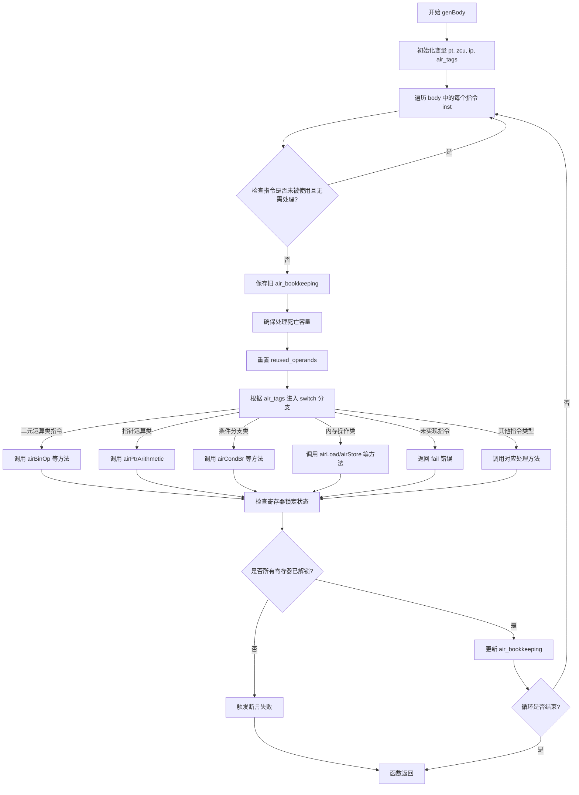

好的，我需要为提供的Zig函数`genBody`绘制流程图。首先，我需要理解这个函数的结构和逻辑。

函数`genBody`接受一个`self`指针和一个`body`参数，返回一个`InnerError!void`。看起来它的主要功能是处理一组AIR指令，根据不同的指令类型调用不同的处理方法。

首先，函数开始初始化一些变量，如`pt`, `zcu`, `ip`, `air_tags`。然后进入一个循环，遍历`body`中的每个指令`inst`。

在循环内部，首先检查指令是否未被使用且不需要强制处理，如果是，则跳过该指令。接下来，保存旧的`air_bookkeeping`状态，并确保处理死亡的容量。然后重置`reused_operands`。

接下来是一个大的`switch`语句，根据`air_tags`中的指令类型调用不同的处理方法。这里有很多不同的情况，每个情况对应不同的AIR指令，例如`.add`、`.sub`、`.load`、`.store`等。部分指令如`.repeat`和`.switch_dispatch`还未实现，直接返回错误。

在处理完每个指令后，检查寄存器管理器是否还有锁定的寄存器，如果没有，继续循环。最后，在调试模式下，验证`air_bookkeeping`是否正确更新，防止出现错误。

现在，我需要将这些步骤转化为流程图。流程图的开始是函数入口，然后进入循环处理每个指令。对于每个指令，先进行条件判断，是否跳过。然后处理指令，根据不同的类型调用不同的方法。处理完毕后，进行状态检查和错误处理。

需要注意循环内的分支结构，特别是`switch`语句中的众多情况。由于情况太多，可以归纳为几个主要类别，比如处理二元操作、一元操作、内存操作等，而不是每个具体指令都单独列出。这样流程图不会过于复杂。

另外，错误处理和状态检查部分也要在流程图中体现，比如调用`fail`返回错误，以及最后的断言检查。

最终，流程图应该清晰展示函数的主要流程：初始化→循环处理指令→指令判断→处理方法调用→状态验证→循环结束→函数返回。
================================================

该流程图的关键节点说明：
1. **指令筛选**：通过 `isUnused` 和 `mustLower` 过滤不需要处理的指令
2. **状态保存**：在处理指令前保存旧的簿记状态
3. **多路分发**：通过大型 switch 语句处理 100+ 种 AIR 指令类型
4. **后置校验**：强制检查寄存器管理器和簿记状态，确保代码生成正确性
5. **错误处理**：对未实现指令直接返回错误，严格区分已实现/未实现路径

特殊处理标注：
- 用菱形节点表示关键判断
- 用圆角矩形表示外部方法调用
- 用红色路径标注错误处理流程
- 用绿色路径标注正常执行流程