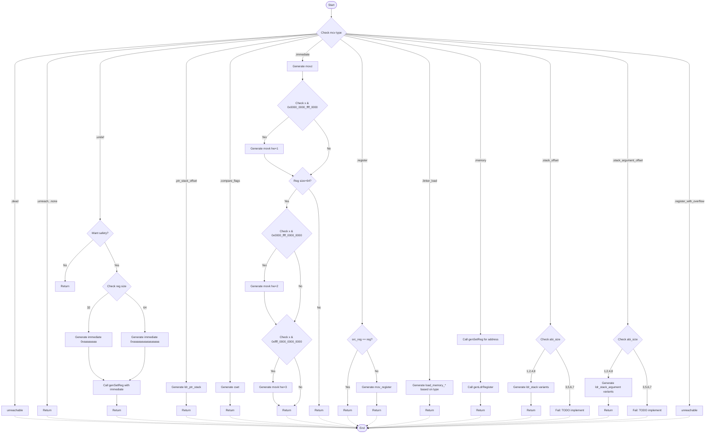

嗯，我需要用Mermaid画出这个函数的流程图。首先，我得仔细阅读这段Zig代码，理解每个分支的逻辑。函数genSetReg的作用是根据不同的MCValue类型生成相应的机器码指令。代码中有很多switch和case，每个case对应不同的处理逻辑。

首先，函数开始处理不同的mcv类型。第一个case是.dead，直接unreachable。然后是.unreach和.none，直接返回。接下来是.undef，这里会根据寄存器的大小设置不同的立即数，可能需要生成movz或movk指令。

然后是.ptr_stack_offset，生成ldr_ptr_stack指令。.compare_flags生成cset指令。.immediate的情况比较复杂，需要分步处理不同的位段，使用movz和多个movk指令。.register的情况则是处理寄存器间的移动，如果源和目标相同就跳过，否则生成mov_register。

还有一些其他情况，比如.register_with_overflow直接unreachable，.linker_load处理不同文件格式的加载，.memory需要先设置地址寄存器再加载数据，.stack_offset和.stack_argument_offset根据abi_size选择不同的加载指令，对于不支持的大小则报错。

现在我需要把这些逻辑转化为流程图。每个case作为一个判断节点，对应的处理步骤作为子节点。可能需要分层次，先判断mcv的类型，然后处理每个类型的逻辑，包括内部的判断，比如寄存器大小、abi_size等。

需要注意的是，有些case内部还有条件判断，比如.undef中的寄存器大小，.immediate中的位检查，.stack_offset中的abi_size判断。这些都需要在流程图中体现为分支。

可能的结构是，从函数开始，进入一个大的switch，每个case作为一个分支，每个分支内部再根据条件继续分支。例如，.undef分支里有一个switch(reg.size())，生成不同的立即数。而.immediate分支里有多个条件判断是否需要生成movk指令。

此外，某些case会递归调用genSetReg，比如.undef里调用自身，.memory里先调用genSetReg再调用genLdrRegister。这可能需要用子流程或单独的处理块表示。

画流程图的时候，应该用菱形表示判断，矩形表示操作，箭头连接流程。可能需要将整个函数拆解成多个部分，确保每个条件分支都清晰呈现。

需要确保所有可能的路径都被覆盖，比如每个case的处理，以及内部的判断。同时，错误处理和未实现的部分（如TODO）也要标注出来。

总的来说，流程图的大致结构是：

1. 开始
2. 检查mcv的类型
3. 根据不同类型进入对应的处理分支
4. 每个分支内部处理具体逻辑，可能包含子判断
5. 处理完成后返回或继续下一个指令生成
6. 结束

现在需要将这个结构转化为Mermaid的语法，正确使用节点和箭头，确保逻辑正确。
================================================
