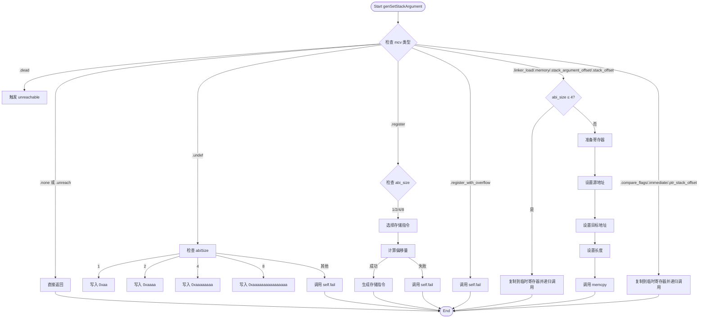

好的，我需要为提供的Zig函数`genSetStackArgument`绘制一个流程图。首先，我需要理解这个函数的结构和逻辑。

函数的主要目的是生成设置堆栈参数的代码。它处理不同类型的`MCValue`，并根据不同的情况执行不同的操作。我需要分析每个分支，并将它们转化为流程图的节点和判断条件。

首先，函数接收四个参数：`self`、`ty`、`stack_offset`和`mcv`。然后根据`mcv`的不同情况进行分支处理：

1. **处理`.dead`情况**：直接触发`unreachable`，说明不应该出现这种情况。
2. **处理`.none`和`.unreach`情况**：直接返回。
3. **处理`.undef`情况**：根据`ty`的`abiSize`设置不同的立即数，或者调用`self.fail`。
4. **处理`.register`情况**：根据`abi_size`选择不同的存储指令，处理不同的偏移量，生成对应的机器指令。
5. **处理`.register_with_overflow`情况**：直接调用`self.fail`。
6. **处理`.linker_load`、`.memory`、`.stack_argument_offset`、`.stack_offset`情况**：如果`abi_size`较小，复制到临时寄存器；否则，准备寄存器并调用`memcpy`。
7. **处理其他情况（如`.immediate`等）**：复制到临时寄存器并递归调用自身。

接下来，我需要将这些逻辑转化为流程图。使用Mermaid的流程图语法，每个条件分支用菱形表示，处理步骤用矩形，连接线表示流程走向。

需要注意的几个点：

- 对于`.undef`情况，根据不同的`abiSize`有不同的处理，需要多个分支。
- `.register`情况中，根据`abi_size`的值有不同的处理，涉及多个条件判断。
- 较大的`abi_size`需要调用`memcpy`，这部分可能需要多个步骤，比如分配寄存器、设置源和目标地址等。
- 递归调用的情况需要特别注意，比如在最后处理`.immediate`时，调用`self.genSetStackArgument`。

在绘制过程中，可能需要将复杂的条件分支拆分为多个节点，确保流程清晰。同时，需要处理错误情况，例如调用`self.fail`时的流程。

现在，将这些分析转化为Mermaid流程图。
================================================

流程说明：
1. 函数入口首先检查 `mcv` 类型
2. 对 `.undef` 情况根据 `abiSize` 填充不同魔数
3. `.register` 分支需要根据数据类型选择存储指令，并计算有效偏移量
4. 大对象（abi_size >4）需要准备寄存器并调用 memcpy
5. 其他值类型（如立即数）通过递归调用处理
6. 所有路径最终汇聚到结束节点
7. 失败路径直接调用 `self.fail` 并终止流程