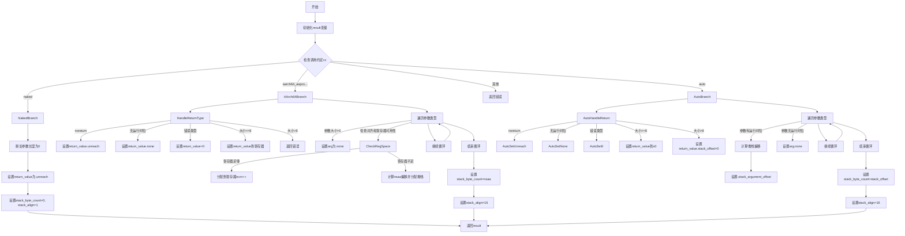

好的，我现在需要帮用户用Mermaid画出给定Zig函数的流程图。首先，我需要仔细阅读并理解这个函数的功能和结构。

函数名为`resolveCallingConventionValues`，属于AArch64架构的代码生成部分。主要处理不同调用约定下的参数传递和返回值设置。函数返回`CallMCValues`结构，包含参数、返回值、堆栈字节数和对齐方式等信息。

函数开始部分初始化了`result`变量，处理了错误释放内存的情况。然后根据不同的调用约定（cc）分支处理，特别是`.naked`、`.aarch64_aapcs`相关变种和`.auto`，其他情况返回错误。

接下来，我需要将每个分支的逻辑转化为流程图。流程图的起点是函数开始，初始化result，然后根据cc的值分三个主要分支：naked、aarch64_aapcs系列、auto，以及其他情况。

对于每个分支：
1. **naked**：检查参数数量是否为0，设置返回值等。
2. **aarch64_aapcs**：处理返回类型的大小和对齐，遍历参数类型，分配寄存器或堆栈位置，计算堆栈大小和对齐。
3. **auto**：类似处理返回值和参数，但使用不同的规则，比如直接使用x0寄存器，处理堆栈偏移。

需要注意条件判断，比如返回类型是否为noreturn，是否有运行时位，参数大小和对齐方式等。同时，循环处理每个参数，决定其存储方式（寄存器或堆栈）。

在绘制流程图时，需要将每个条件判断用菱形框表示，操作用矩形框，流程箭头表示执行顺序。可能需要多个分支和子流程，尤其是处理参数循环部分。

需要确保所有可能的路径都被覆盖，例如在aarch64_aapcs分支中，参数可能分配到寄存器或堆栈，这取决于ncrn和nsaa的值。同时，错误处理部分如`self.fail`也需要表示出来。

最后，合并各个分支，设置stack_byte_count和stack_align，然后返回结果。

可能遇到的挑战是如何简洁地表示循环和条件嵌套，同时保持流程图的可读性。可能需要将循环部分简化为一个处理步骤，用注释说明循环内的逻辑，或者拆分子图。但根据用户要求，应该在一个流程图中呈现，所以需要合理布局。

总结，流程图的大致结构如下：
- 开始
- 初始化result
- 检查cc类型
  - 如果是naked：设置返回值和堆栈信息
  - 如果是aarch64_aapcs系列：处理返回类型，遍历参数分配寄存器或堆栈
  - 如果是auto：处理返回类型，遍历参数分配堆栈偏移
  - 其他情况：返回错误
- 设置堆栈大小和对齐
- 返回result

需要将每个步骤细化，尤其是条件判断和循环处理参数的部分。
================================================
