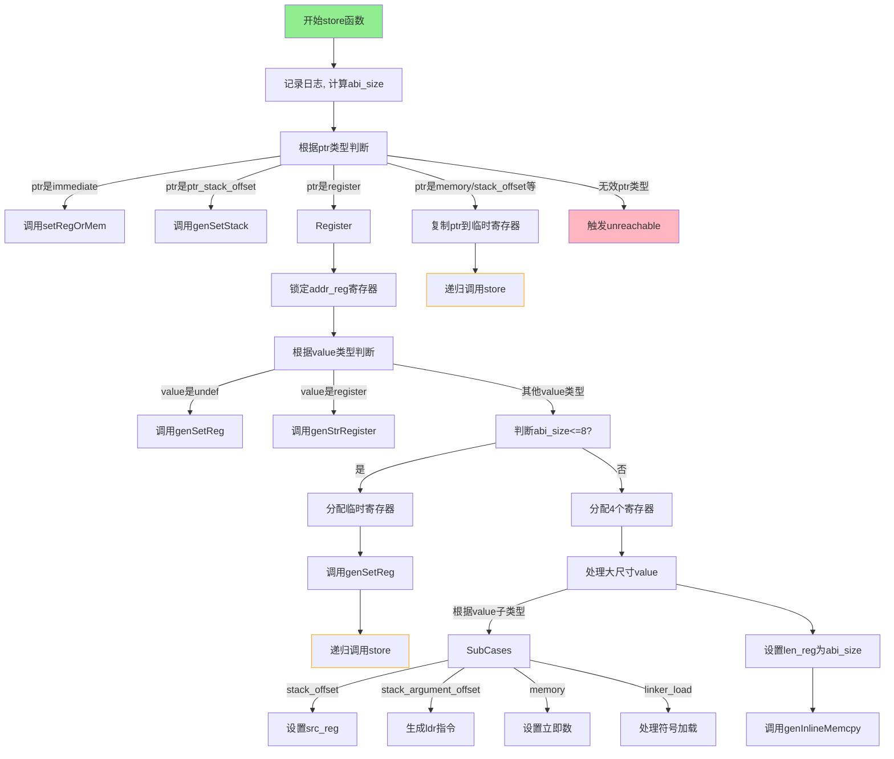

嗯，我需要为这个Zig函数生成一个流程图。首先，我得仔细阅读代码，理解它的逻辑结构。函数名为store，参数包括self指针、ptr和value（都是MCValue类型）、ptr_ty和value_ty（Type类型）。它的作用似乎是将value存储到ptr指向的位置。

首先，函数开始处有一些日志记录，然后获取abi_size。接下来是一个大的switch语句，根据ptr的不同类型进行处理。我需要把每个分支的情况都理清楚。

第一个case是ptr为.none、.undef等，这些都是unreachable，表示这些情况不应该发生。然后是.immediate的情况，这里调用setRegOrMem方法。接下来是.ptr_stack_offset，调用genSetStack。

当ptr是.register时，处理比较复杂。这里又分value的不同情况，比如.dead、.undef、.register，以及其他情况。特别是当value的abi_size大于8时，会分配多个寄存器，处理不同的value类型，如.stack_offset、.stack_argument_offset等，最后调用genInlineMemcpy。

另外，当ptr是.memory、.stack_offset等类型时，会调用copyToTmpRegister，将ptr复制到寄存器，然后递归调用store函数。

我需要将这些逻辑分支用流程图表示出来。可能需要使用条件判断、循环和子流程。比如，主switch分支下有不同的处理路径，每个路径可能有进一步的判断和处理步骤。

需要注意的是，有些步骤是嵌套的，比如在.register的value处理中，又有一个switch处理不同的value类型。这种情况下，流程图需要分层显示，确保每个分支都清晰。

另外，递归调用store的情况也需要在流程图中表示出来，可能需要用子流程或者跳转节点。

可能遇到的困难是代码中有多个嵌套的switch和条件判断，需要合理组织流程图的结构，避免过于复杂。同时，确保每个case的处理步骤正确对应代码逻辑。

现在，我需要将这些逻辑转化为mermaid的流程图语法，使用节点、条件判断、子程序等元素，清晰地展示函数的执行流程。
================================================
