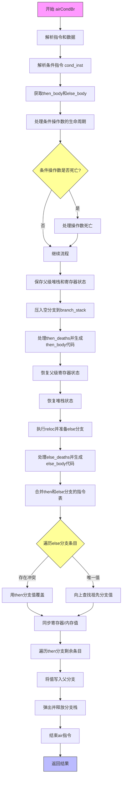

嗯，我需要为这个Zig函数`airCondBr`画一个流程图。首先，我得理解这个函数是做什么的。看起来像是处理条件分支的，比如if-else结构。函数名`airCondBr`中的“CondBr”可能代表条件分支（Conditional Branch）。

让我先通读代码，理清主要步骤。函数开始处获取了一些操作数和额外数据，然后处理条件指令。接着保存当前的寄存器状态和堆栈偏移，生成then分支的代码，恢复状态，处理else分支，最后合并两个分支的状态。

接下来，我需要把每个步骤转化为流程图的节点。可能会有判断点，比如条件是否死亡，以及处理then和else分支的不同流程。需要注意的是，流程图中需要包含错误处理（errdefer）和资源释放（defer）。

在绘制过程中，要注意循环结构，比如处理then_deaths和else_deaths的循环，以及后面的合并过程。此外，生成then和else分支代码后，需要合并两个分支的指令表，确保寄存器分配一致。

需要确认每个步骤之间的连接是否正确，尤其是恢复状态和合并部分。可能还需要考虑异常情况下的流程，比如errdefer块中的处理。

最后，将所有这些步骤用Mermaid的流程图语法表示出来，确保节点和箭头正确反映函数逻辑。
================================================
