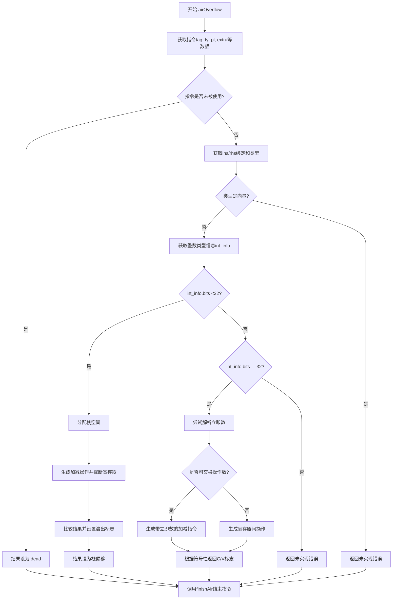

好的，我需要为提供的Zig函数`airOverflow`绘制流程图。首先，我要理解这个函数的结构和逻辑。

函数开始于获取指令的标签（tag）、类型和负载（ty_pl）以及额外的数据（extra）。接着，初始化一些变量，如pt、zcu，并处理结果MCValue。如果指令未被使用，结果设为.dead，否则进入主要逻辑。

主要逻辑分为几个部分：
1. 处理向量类型，直接返回未实现错误。
2. 处理整数类型，根据位数（bits）不同分为小于32位、等于32位和大于32位的情况。
   - 对于小于32位的整数，分配内存，处理溢出标志，执行加减操作，截断寄存器，比较结果，设置栈上的值和溢出位。
   - 对于等于32位的整数，处理立即数，生成相应的汇编指令（adds或subs），并根据有符号性返回不同的标志寄存器。
   - 大于32位的整数则返回未实现错误。
3. 最后，调用finishAir结束指令处理。

接下来，我需要将这些步骤转化为流程图。流程图的开始是函数入口，然后根据条件分支处理不同的情况。需要注意条件判断，如类型检查、位数判断、立即数处理等。每个分支结束后，最终汇聚到finishAir。

可能遇到的难点是正确处理条件分支的嵌套结构，特别是处理32位整数时的各种情况，需要确保所有可能的路径都被覆盖。此外，确保错误处理和未实现的部分也被正确表示在流程图中。

需要确认每个条件判断后的操作步骤，例如截断寄存器、生成汇编指令、设置栈值等，都要在流程图中明确展示。同时，注意函数最后的返回步骤，确保所有路径最终都到达这一点。

总结来说，流程图需要包括：
- 函数入口
- 初始化变量
- 检查指令是否未使用（直接返回.dead）
- 处理向量类型（返回错误）
- 处理整数类型的不同位数情况
- 每个情况下的具体操作步骤
- 错误处理
- 最终结束指令处理

现在，根据这些分析，可以开始绘制Mermaid流程图了。
================================================
