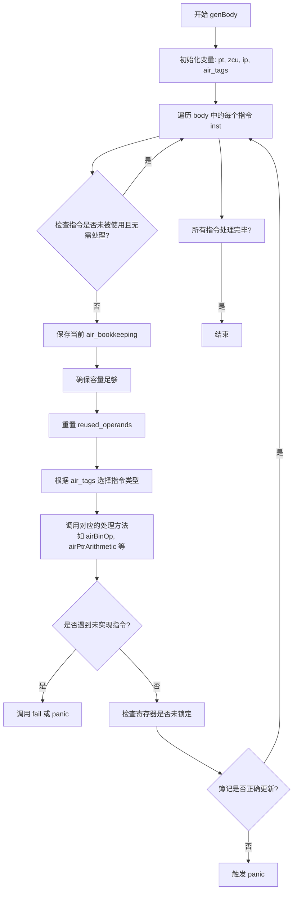

好的，我需要为提供的Zig函数`genBody`画一个流程图。首先，我需要理解这个函数的结构和逻辑。

函数`genBody`接收一个`self`指针和一个`body`参数，`body`是一个指令索引的切片。函数的主要任务是遍历`body`中的每个指令，并根据指令类型调用相应的处理函数。

首先，函数初始化一些变量，如`pt`、`zcu`、`ip`和`air_tags`。然后，它开始遍历`body`中的每个指令`inst`。对于每个指令，首先检查该指令是否未被使用且不需要强制处理，如果是，则跳过该指令。接下来，保存当前的`air_bookkeeping`状态，并确保有足够的容量处理生命周期。然后，重置`reused_operands`，并根据`air_tags`中的指令类型进行分支处理，调用不同的方法如`airBinOp`、`airPtrArithmetic`等。

在处理完指令后，检查是否存在锁定的寄存器，确保没有遗漏。最后，在调试模式下，验证`air_bookkeeping`是否正确更新，防止簿记错误。

接下来，我需要将这些步骤转化为流程图。流程图的开始是函数入口，然后进入循环遍历每个指令。对于每个指令，进行条件判断是否跳过，然后处理指令，最后进行簿记验证。每个分支处理不同的指令类型，但由于种类繁多，可能需要用概括的方式表示，避免过于详细。

需要注意循环结构、条件判断以及错误处理部分。特别是`switch`语句中的多个分支，可以简化为一个决策节点，表示根据指令类型选择不同的处理方法。同时，需要处理可能的错误，如`fail`和`unreachable`情况。

最后，确保流程图的连贯性和逻辑正确性，包括循环的结束条件和异常情况的处理。
================================================

流程说明：
1. 函数开始后初始化关键变量
2. 进入循环遍历所有AIR指令
3. 对每个指令进行有效性检查，跳过无用指令
4. 保存簿记状态并确保内存容量
5. 根据指令类型分发到不同的处理方法
6. 处理未实现指令的错误情况
7. 检查寄存器状态和簿记完整性
8. 循环直至处理完所有指令
9. 最终结束流程

对于庞大的switch分支进行了抽象表示，实际实现中包含100+种指令类型的处理分支，图中用"调用对应的处理方法"统一表示。错误处理路径用红色虚线表示关键检查点。