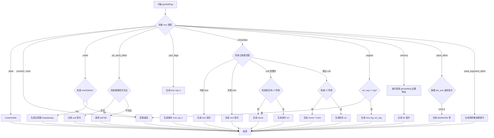

好的，我需要帮助用户用Mermaid画出给定Zig函数的流程图。首先，我需要仔细阅读并理解这个函数的逻辑。函数名为genSetReg，看起来是用于生成设置寄存器的汇编代码。函数接受类型、寄存器和MCValue，然后根据不同的MCValue情况生成不同的指令。

首先，我会逐一分析函数中的每个case：

1. **.dead**：直接unreachable，表示不应该出现这种情况。
2. **.unreach, .none**：直接返回，不做任何操作。
3. **.undef**：如果不需要安全检查，直接返回；否则生成一个立即数0xaaaaaaaa到寄存器。
4. **.ptr_stack_offset**：处理栈偏移，生成sub指令。
5. **.cpsr_flags**：根据条件标志设置寄存器，先mov 0，再根据条件mov 1。
6. **.immediate**：处理立即数，可能有多种情况：直接mov，使用mvn，或者分多次写入（如movw和movt，或者多个orr操作）。
7. **.register**：如果源寄存器和目标寄存器不同，生成mov指令。
8. **.memory**：递归调用genSetReg设置地址，然后加载数据。
9. **.stack_offset**：根据类型大小和符号选择不同的加载指令（如ldrb、ldrh、ldr等），处理不同的偏移情况。
10. **.stack_argument_offset**：类似stack_offset，但使用不同的标签处理参数栈偏移。

接下来，我需要将这些逻辑转化为流程图。流程图应该从函数入口开始，然后根据不同的MCValue分支处理，每个分支内部的具体操作也要细化。需要注意的是条件判断，如检查是否有v7特性、立即数是否在特定范围内等。

需要注意的几个复杂点：

- **.immediate**的情况有多个子条件，需要分层次处理。
- **.stack_offset**和**.stack_argument_offset**根据类型大小和符号选择不同的指令标签。
- 递归调用的情况（如**.memory**中的genSetReg和genLdrRegister）。

此外，需要确保所有可能的路径都被覆盖，并且条件判断正确嵌套。

现在，我需要将这些步骤结构化，使用Mermaid的语法来表示流程。每个case作为一个分支，内部的条件判断使用菱形节点，操作用矩形节点，箭头表示流程方向。

可能还需要处理一些错误情况，如self.fail("TODO larger stack offsets", .{})，但用户可能不需要在流程图中包含错误处理细节，只需主要路径。

最后，确保流程图的逻辑清晰，层次分明，每个分支处理得当，没有遗漏重要的步骤。
================================================
