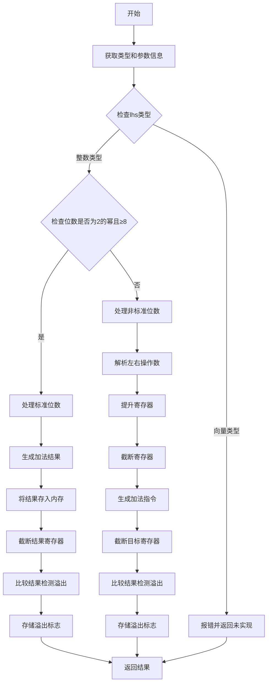

嗯，我需要为这个Zig函数`airAddWithOverflow`画一个流程图。首先，我得仔细阅读代码，理解它的结构和工作流程。函数的主要功能是处理带有溢出检查的加法操作，对吧？

首先，函数开始处获取了一些类型和参数的信息，比如`pt`、`zcu`、`ty_pl`和`extra`。接着，它检查左边的类型（`lhs_ty`）是否是整数或向量类型。如果是向量，就返回未实现的错误。如果是整数，就继续处理。

然后，函数根据整数类型的位数是否是8的倍数且是2的幂来处理不同的情况。如果满足条件，它会生成加法结果，并处理溢出检测。否则，它会处理非标准整数位数的加法，同样生成结果并检测溢出。

在处理过程中，函数会分配寄存器或内存来存储结果，进行加法运算，截断寄存器以检查溢出，最后将结果和溢出标志存储到内存中。最后，函数返回结果。

在画流程图时，我需要把主要的分支和步骤列出来。可能的结构是：

1. 开始
2. 获取类型和参数信息
3. 检查左边类型是否为向量，如果是，报错并返回
4. 如果是整数，检查其位数是否符合条件
5. 处理符合条件的情况（标准整数位数）
   a. 生成加法结果
   b. 将结果存入内存
   c. 截断寄存器
   d. 比较结果，检测溢出
   e. 存储溢出标志
6. 处理不符合条件的情况（非标准整数位数）
   a. 解析左右操作数
   b. 提升寄存器
   c. 截断寄存器
   d. 生成加法指令
   e. 截断结果寄存器
   f. 比较结果，检测溢出
   g. 存储溢出标志
7. 返回结果

需要注意的是条件分支和循环，以及各个步骤之间的依赖关系。例如，处理标准和非标准整数位数的路径是不同的，但最终都要存储结果和溢出标志。另外，流程图中需要体现错误处理（如返回未实现的情况）。

可能遗漏的点是错误处理的具体路径，以及各个寄存器的分配和释放步骤。不过为了简化流程图，可能不需要画出每个寄存器的操作，而是概括为“分配寄存器”、“截断寄存器”等步骤。

最后，使用Mermaid的语法将这些步骤转化为流程图，注意正确的节点和箭头连接，确保逻辑流程正确。
================================================

流程图说明：
1. **左侧分支**处理向量类型直接报错
2. **右侧主流程**处理整数类型，根据位数是否标准分为两条路径：
   - 标准位数路径直接生成加法结果并检测溢出
   - 非标准位数路径需要显式处理寄存器提升和截断
3. 所有路径最终汇聚到返回结果节点
4. 关键操作用矩形表示，判断条件用菱形表示
5. 寄存器操作（截断/提升）被抽象为独立步骤，避免代码级细节