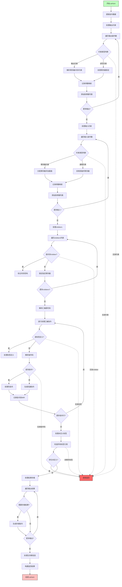

好的，我需要为提供的Zig函数`airAsm`绘制流程图。首先，我需要理解这个函数的功能和结构。

从代码来看，`airAsm`函数处理内联汇编指令。它解析汇编模板、约束、输入输出操作数，并生成相应的机器码。函数主要分为几个部分：

1. **提取指令数据**：从`Air`结构中获取类型和有效载荷信息，解析输出和输入操作数。
2. **处理输出约束**：解析每个输出操作数的约束，处理寄存器分配和内存约束。
3. **处理输入约束**：类似输出，处理输入操作数的约束，确保寄存器正确分配。
4. **处理clobbers**：处理被内联汇编修改的寄存器，确保它们被正确标记以避免冲突。
5. **解析汇编源代码**：逐行处理汇编指令，处理标签、伪指令和实际机器指令。
6. **生成机器码**：根据解析的指令和操作数生成对应的机器码指令。
7. **处理结果和清理**：将结果存储到适当的位置，处理生存期信息，完成指令处理。

接下来，我需要将这些步骤转化为流程图。每个主要部分将作为一个流程节点，关键判断和循环也需要体现。例如，处理输出和输入约束时会有条件判断，解析汇编源代码时会有循环处理每行指令，生成机器码时可能根据指令类型分支。

需要注意的是，流程图中应包含错误处理路径，例如当遇到无效约束或未定义标签时，函数会调用`func.fail`返回错误。此外，寄存器管理和释放的逻辑也需要在流程中体现，尤其是在处理输出和输入操作数后的`defer`块中释放锁定的寄存器。

在绘制流程图时，应使用不同的形状表示不同的步骤：矩形框表示处理步骤，菱形表示条件判断，平行四边形表示输入/输出。对于循环结构，可以使用循环节点或箭头返回之前的位置。

最后，需要确保流程图的逻辑与代码结构一致，覆盖所有主要路径和错误情况，同时保持清晰易懂，便于理解函数的整体流程。
================================================

流程图说明：
1. 从提取指令数据开始，逐步处理输出/输入约束和clobbers
2. 解析汇编源代码时采用双路径处理：标签定义和指令解析
3. 伪指令处理包含特殊操作（如li/mv/ret等）
4. 包含多层错误检测路径（红色节点表示错误出口）
5. 结果处理阶段包含寄存器回写和生存期管理
6. 使用不同颜色区分开始/结束节点和错误节点
7. 菱形节点表示关键判断点，矩形节点表示处理步骤