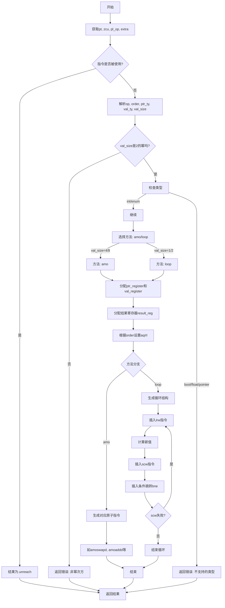

嗯，我现在要帮用户用Mermaid画一个函数的流程图。这个函数是Zig写的，名字叫airAtomicRmw，属于RISC-V 64架构的代码生成部分。首先，我需要理解这个函数的结构和逻辑流程，然后才能画出正确的流程图。

首先，我看看这个函数的大体结构。函数开始于定义一些变量，比如pt、zcu、pl_op、extra，这些都是从函数参数或Air指令中获取的数据。然后，函数处理原子操作（AtomicRmw），根据不同的操作类型生成相应的机器码。

接下来，函数检查结果是否被使用，如果未被使用（isUnused），就直接返回.unreach。否则，进入处理逻辑。这里有一个大的block，里面处理各种情况，包括操作类型（op）、内存序（order）、指针类型（ptr_ty）、值类型（val_ty）等。

然后，函数根据val_size是否为2的幂次方来检查，如果不是则返回错误。接着，根据值的类型（int、enum、bool、float等）处理不同的情况，如果是bool、float、pointer则暂时不支持，返回TODO错误。

接下来，根据val_size的大小选择方法（method），分为.amo和.loop。对于不同的method，处理方式不同。例如，当val_size是4或8时，使用.amo方法，直接生成相应的原子操作指令；对于1或2字节的情况，使用.loop方法，通过循环（load-reserved/store-conditional）来实现原子操作。

然后，处理指针和值的寄存器分配，获取ptr_register和val_register，并处理寄存器的锁定和解锁。接着，分配结果寄存器result_reg。

之后，根据内存序（order）确定aq和rl的值，这些是原子操作的内存顺序参数。在.amo方法中，根据操作类型（op）生成对应的Mnemonic指令，比如amoswapd、amoaddd等，并生成相应的机器指令。在.loop方法中，生成循环结构的指令，比如lrw（load-reserved）、scw（store-conditional）和条件跳转bne，直到操作成功。

最后，函数返回结果，并调用finishAir结束指令处理。

现在，我需要将这些步骤转化为流程图。流程图的开始是函数的入口，然后逐步处理各个条件分支。需要注意条件判断，比如检查val_size是否为2的幂、类型检查、选择method、处理不同的op等。每个条件分支都需要相应的判断框和处理步骤。

可能的流程如下：

1. 开始
2. 获取pt, zcu, pl_op, extra等参数
3. 检查指令是否被使用（isUnused），如果是，结果为.unreach，结束
4. 否则，解析op、order、ptr_ty、val_ty、val_size等
5. 检查val_size是否为2的幂，不是则返回错误
6. 检查类型，如果是bool、float、pointer等不支持的类型，返回TODO错误
7. 根据val_size选择method（.amo或.loop）
8. 分配ptr和val的寄存器，处理锁定
9. 分配结果寄存器result_reg
10. 根据order确定aq和rl
11. 根据method分支：
    a. .amo方法：生成对应的原子指令
    b. .loop方法：生成循环结构，包括lrw、计算新值、scw、条件跳转
12. 结束，返回结果

需要注意各个判断点的分支，以及不同情况下的处理步骤。例如，在.amo方法中，不同的op对应不同的mnemonic；在.loop方法中，不同的op（如Add、Sub）需要不同的处理，但目前只实现了Add和Sub，其他op返回TODO错误。

可能遗漏的细节：比如在.loop方法中，处理完计算新值后，使用scw尝试存储，如果失败则跳转回lrw重新加载。这个过程需要循环直到成功。这在流程图中应该表现为一个循环结构。

另外，错误处理的部分（如返回func.fail）也需要在流程图中体现，可能作为终止流程的节点。

现在，将这些步骤用Mermaid语法表示出来，确保每个判断和操作都有对应的节点和箭头。注意正确使用条件判断和子流程。
================================================
