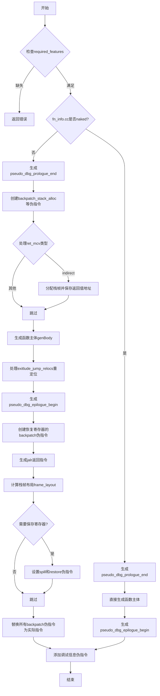

嗯，我现在需要为这个Zig函数画一个流程图。首先，我得仔细看一下这个函数的代码结构，理解它是如何工作的。这个函数是gen，属于RISC-V 64位的代码生成部分。看起来主要是处理函数的代码生成，包括一些序言和尾声的设置，还有处理返回值的存储和恢复寄存器等。

首先，函数开始的时候检查是否有必需的特性（required_features），如果缺少某个特性，就会返回错误。这部分应该是一个条件判断，如果条件不满足就进入错误处理流程。

接下来，函数判断调用约定是否是naked，如果不是的话，会生成一些伪指令，比如pseudo_dbg_prologue_end。然后创建一些backpatch的伪指令，比如backpatch_stack_alloc，这些可能在后面会被替换成实际的指令。然后处理返回值的间接存储，如果返回类型是间接的，就需要将返回值地址保存到栈帧中。

之后，生成函数的主体代码，处理exitlude_jump_relocs中的跳转重定位，设置epilogue开始的伪指令，然后处理恢复寄存器的backpatch，最后生成jalr指令作为返回。

计算栈帧布局frame_layout，根据是否需要保存寄存器来决定是否生成保存和恢复寄存器的指令。如果调用约定是naked的话，流程会简单一些，直接生成主体代码和调试信息。

最后，添加一个伪指令来标记调试信息的结束位置。

现在我需要把这些步骤转化为流程图的结构。可能的流程是：

1. 检查required_features，如果有缺失则报错。
2. 判断fn_info.cc是否为naked：
   - 如果不是naked：
     a. 生成prologue_end伪指令。
     b. 创建多个backpatch伪指令。
     c. 处理返回值间接存储的情况。
     d. 生成函数主体。
     e. 处理跳转重定位。
     f. 生成epilogue_begin伪指令。
     g. 创建恢复寄存器的backpatch。
     h. 生成jalr返回指令。
     i. 计算栈帧布局。
     j. 根据是否需要保存寄存器，设置相应的backpatch指令。
     k. 替换backpatch伪指令为实际指令。
   - 如果是naked：
     a. 生成prologue_end。
     b. 生成函数主体。
     c. 生成epilogue_begin。
3. 添加调试信息伪指令。

需要注意的是，流程中的分支和循环结构，比如inline for检查required_features，以及后续的多个条件判断，比如switch (func.ret_mcv.long)等。同时，backpatch的处理可能需要替换之前的伪指令，这在流程图中可能需要表示为并行或后续步骤。

可能用条件判断框来区分naked和非naked的情况，然后每个分支内的操作用顺序步骤表示。此外，像处理ret_mcv的部分属于条件分支中的一部分，也需要表示出来。

可能需要使用多个子流程，尤其是处理非naked情况下的大量步骤，可能需要分解成子步骤。另外，替换backpatch的步骤可能需要详细说明每个backpatch的设置。

最终的流程图应该能够清晰地展示函数的主要分支和关键操作步骤，特别是条件判断和不同路径的处理。
================================================

该流程图的关键逻辑：
1. 通过菱形节点实现多级条件判断（特性检查/naked判断/寄存器保存判断）
2. 使用并行路径处理naked和非naked两种场景
3. backpatch机制通过"创建伪指令-最终替换"两步实现
4. 关键操作节点包含：
   - 栈分配/返回值地址保存
   - 函数主体生成
   - 跳转重定位
   - 寄存器保存恢复
   - 调试信息标记
5. 最终统一到调试信息生成结束流程

特殊符号说明：
- 菱形节点：条件判断
- 矩形节点：具体操作步骤
- 箭头流向：执行顺序和条件分支