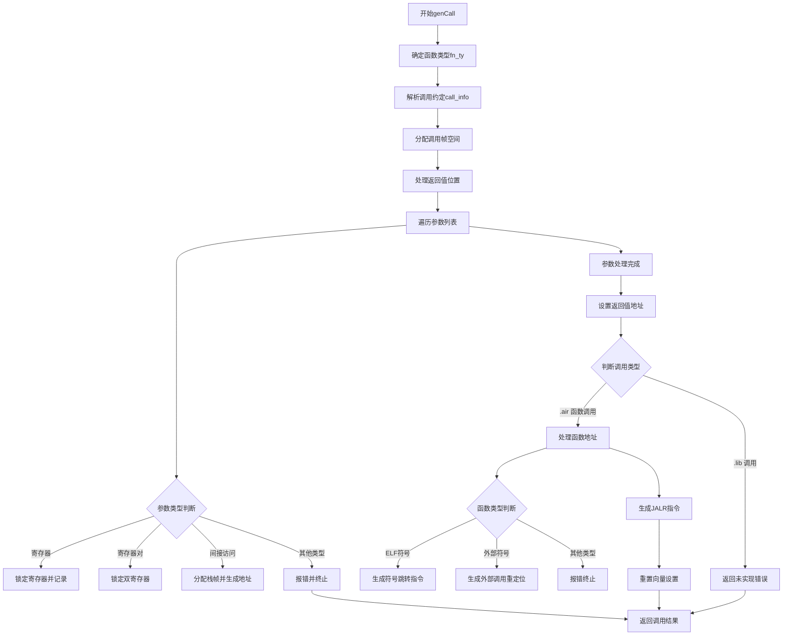

嗯，我需要为提供的Zig代码中的genCall函数绘制流程图。首先，我得通读代码，理解它的主要步骤和逻辑结构。genCall函数似乎是用来生成函数调用的代码，处理不同的调用情况，比如直接调用或库函数调用。

首先，函数开始处理不同的info类型，可能是通过AIR指令或库函数。然后确定函数类型，接着处理参数和返回值。接下来，分配调用帧，处理寄存器的锁定和解锁，设置参数到寄存器或内存中，生成实际的调用指令，比如JALR，最后处理返回值并清理资源。

我需要将这些步骤分解成流程图中的各个节点。可能的分支包括处理不同的info类型（.air和.lib），处理不同的参数传递方式（寄存器、寄存器对、间接访问等），以及不同的返回值处理。还需要考虑错误处理和资源释放，比如defer语句释放分配的内存和寄存器锁。

需要注意的是，代码中有多个switch语句，每个case对应不同的处理逻辑，这些在流程图中应该表现为不同的分支。例如，当info是.air时，处理函数值或外部符号；当info是.lib时，返回未实现的错误。此外，参数传递的方式（register, register_pair, indirect等）也会有不同的处理路径。

在绘制流程图时，应该从函数入口开始，按照代码的执行顺序逐步展开每个主要步骤，包括条件判断和循环。例如，处理参数时的for循环需要表示为重复的步骤，直到所有参数处理完毕。同时，错误处理部分（如try和return func.fail）也需要在流程图中体现，可能作为终止节点或错误出口。

可能还需要注意函数中的资源管理部分，如allocator的分配和释放，reg_locks的管理，这些在流程图中应表现为分配资源和后续的释放操作，通常在defer语句中处理。

最后，生成的流程图应该清晰展示函数的控制流，包括所有主要决策点和处理步骤，确保逻辑正确且易于理解。
================================================

流程图说明：
1. 函数入口初始化后首先确定函数类型
2. 解析调用约定并分配调用栈空间
3. 处理返回值存储位置
4. 循环处理每个参数：
   - 根据参数传递方式（寄存器/间接等）进行不同处理
5. 处理完所有参数后设置返回值地址
6. 根据调用类型（.air/.lib）进入不同分支：
   - .air分支处理ELF符号/外部符号调用
   - .lib分支直接返回未实现错误
7. 最终生成跳转指令并返回结果
8. 包含错误处理路径和资源清理路径（通过defer机制）