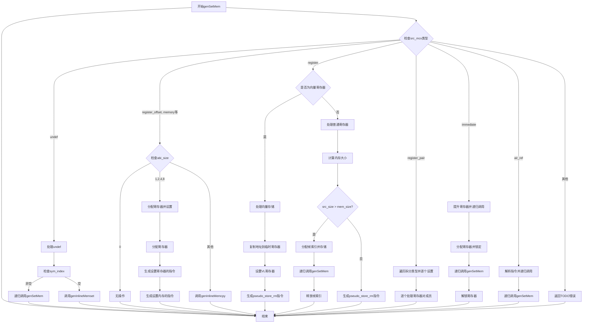

好的，我需要为提供的Zig函数`genSetMem`绘制流程图。首先，我需要理解这个函数的结构和逻辑。函数的作用是将源MCValue（可能是一个寄存器、内存地址等）设置到目标内存位置。根据不同的情况，处理方式也不同。

首先，函数开始部分处理`src_mcv`的不同情况。比如，当`src_mcv`是`.undef`时，可能需要生成符号加载或进行内存设置。接着，对于不同的`abi_size`（ABI大小），处理方式也不同，比如对于1、2、4、8字节，会分配寄存器并生成设置指令；更大的尺寸则使用内联内存拷贝。

另外，当`src_mcv`是寄存器时，还需要区分是否是向量寄存器，如果是的话，处理向量存储。对于普通寄存器，会根据内存大小和分配情况决定如何存储。还有处理寄存器对（register_pair）、立即数（immediate）、以及引用（air_ref）等情况。

接下来，我需要将这些逻辑分支转化为流程图。可能的结构是，从函数入口开始，根据`src_mcv`的不同类型分支出不同的处理路径。每个分支内部可能还有条件判断，比如`abi_size`的值、是否为向量寄存器等。

需要注意的是，流程图中要涵盖所有可能的`src_mcv`情况，包括`.register`, `.register_pair`, `.immediate`, `.air_ref`等，以及对应的处理步骤。例如，当处理`.register`时，可能需要进一步判断是否为向量寄存器，然后执行相应的存储操作。

可能还需要处理异常或错误情况，比如`unreachable`的情况，但根据代码中的`unreachable`关键字，这些可能在流程图中标记为终止节点。

最后，确保每个分支都有正确的连接，比如处理完一个分支后，流程如何继续或结束。可能需要合并一些共同的步骤，比如释放寄存器锁或资源。

总结步骤：
1. 确定函数的主要分支点，特别是`switch (src_mcv)`的各个情况。
2. 对每个分支进行详细分析，包括内部的判断和处理步骤。
3. 将这些分析转化为流程图节点和判断条件。
4. 连接各个节点，确保流程正确。
5. 检查是否有遗漏的情况或错误连接。

现在需要将这些步骤转化为Mermaid的流程图语法。
================================================
