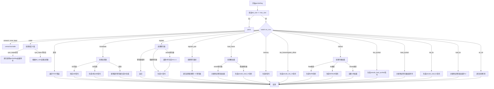

嗯，用户让我用Mermaid来画这个函数的流程图。首先，我需要仔细阅读这个函数，理解它的逻辑结构。这个函数叫genSetReg，看起来是用于生成设置寄存器的代码。函数接收一个Func指针、类型ty、目标寄存器reg和源MCValue src_mcv，然后根据src_mcv的不同情况生成不同的指令。

首先，我需要理清函数的大体流程。函数开始的时候，获取了一些参数，比如abi_size和max_size，然后检查abi_size是否超过max_size，如果是的话就panic。接下来是一个大的switch语句，根据src_mcv的不同情况处理不同的逻辑。

接下来，我要分析每个case分支的处理逻辑。比如，当src_mcv是.immediate时，处理立即数的情况，可能生成addi、lui等指令；如果是.register，处理寄存器到寄存器的移动，考虑不同类型的寄存器（如vector）；还有处理内存加载、符号加载等其他情况。

在画流程图的时候，需要将每个case分支转化为不同的流程节点，并标明各个分支的条件和操作。例如，对于src_mcv的每个可能值，如.immediate、.register、.load_frame等，分别画出处理流程，包括可能的子函数调用或指令生成。

需要注意的是，有些分支内部还有嵌套的条件判断，比如处理.immediate时，根据数值的范围生成不同的指令序列。这时候需要将这些嵌套的条件也体现在流程图中，比如使用判断节点（菱形）来表示条件分支。

此外，函数中有一些错误处理和TODO注释，比如处理未实现的情况时返回fail，这些也应该在流程图中体现出来，可能作为终止节点或错误处理节点。

在绘制过程中，要确保流程图的逻辑正确，每个分支的处理步骤清晰，并且节点之间的连接正确无误。可能需要多次检查，确保没有遗漏重要的分支或步骤。

最后，根据Mermaid的语法，将整个流程用节点、判断、连接线等元素表示出来，保持代码的结构和可读性。
================================================
