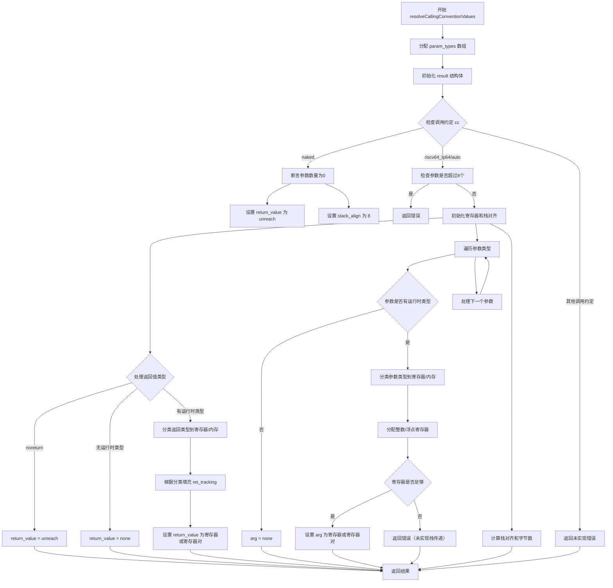

好的，我现在需要根据用户提供的Zig代码，使用Mermaid语法画出函数的流程图。首先，我需要仔细阅读并理解这段代码的功能和结构。

这个函数叫做resolveCallingConventionValues，看起来是处理RISC-V 64位架构的函数调用约定，特别是参数传递和返回值的处理。函数接收一个Func指针、函数类型信息和可变参数类型数组，返回CallMCValues结构体。

首先，函数开始时分配了param_types数组，将固定参数和可变参数合并进去。然后初始化result结构体，其中args数组的长度是参数类型的数量。接下来处理不同的调用约定（cc），比如.naked、.riscv64_lp64、.auto以及其他情况。

在处理返回值的部分，根据返回类型的不同情况（如noreturn、无运行时类型等），设置result.return_value的值。对于有返回类型的情况，分类处理整数寄存器、浮点寄存器和内存情况，并可能使用寄存器对。

参数处理部分，遍历每个参数类型，根据分类（整数、浮点、内存）分配相应的寄存器，如果寄存器不够，可能需要使用栈传递参数，但目前代码中似乎还未完全处理这种情况，因为有一个返回TODO的fail语句。

现在，我需要将这个过程转化为流程图。流程图应该包括开始、各个条件判断、循环处理参数、错误处理以及返回结果等步骤。

可能的步骤分解：
1. 开始函数。
2. 分配param_types数组，合并固定参数和可变参数。
3. 初始化result对象，分配args数组。
4. 根据调用约定cc进行分支处理：
   a. 如果是.naked，检查参数数量是否为0，设置返回值和栈对齐。
   b. 如果是.riscv64_lp64或.auto，检查参数数量是否超过8，处理返回值和参数分配。
   c. 其他调用约定则返回错误。
5. 处理返回值类型，分类为noreturn、无运行时类型或有运行时类型，分别处理寄存器分配。
6. 遍历每个参数类型，分配寄存器，处理整数、浮点和内存情况，若寄存器不足则报错（目前未处理栈传递）。
7. 处理栈对齐和字节计数。
8. 返回结果。

需要注意错误处理的分支，例如参数过多、未实现的调用约定或参数类型分类等导致的错误。

在画流程图时，需要用条件判断框（菱形）来表示分支，如调用约定的选择、返回类型是否有运行时位等。循环处理参数部分需要用循环框，遍历每个参数类型并分配寄存器。

可能遇到的困难是如何正确表示嵌套的条件和循环结构，特别是当处理返回值和参数时存在多个分类情况。需要确保每个分支都被正确表示，并且流程图的箭头指向正确的下一步骤。

另外，代码中的一些错误处理（如func.fail）需要在流程图中体现为终止流程的错误节点。

最后，根据以上分析，用Mermaid语法绘制流程图，确保结构清晰，逻辑正确。
================================================
