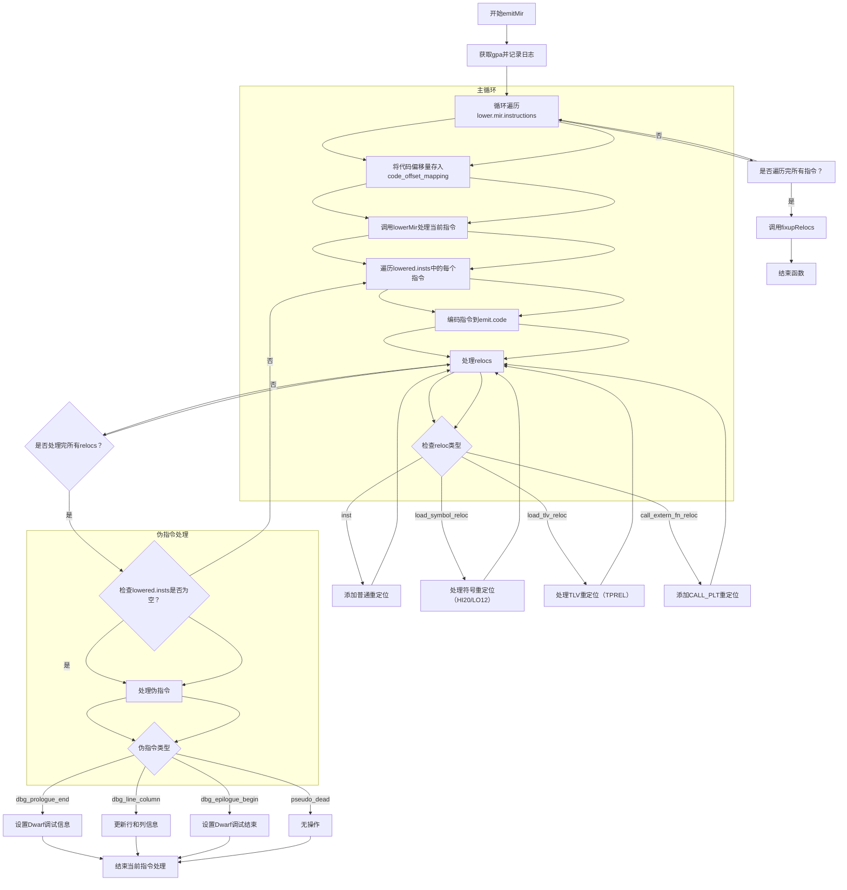

嗯，我需要帮用户用Mermaid画出这个Zig函数emitMir的流程图。首先，我得先理解这段代码的结构和逻辑。

首先，函数emitMir接受一个*Emit参数，返回Error!void。开始部分，获取gpa，记录日志。然后有一个循环，遍历lower.mir.instructions的每个指令。对于每个mir_i，做了一些操作，比如将代码偏移量存入code_offset_mapping，然后调用lowerMir处理当前mir_index，得到lowered和lowered_relocs。

接下来，遍历lowered.insts，处理每个lowered_inst，编码到emit.code中。然后处理relocations，这里有几个不同的情况：.inst、.load_symbol_reloc、.load_tlv_reloc、.call_extern_fn_reloc，每个情况有不同的处理逻辑，比如添加不同的重定位条目到atom_ptr。

之后，检查lowered_relocs是否处理完毕。然后，如果lowered.insts长度为0，处理伪指令，比如调试相关的伪指令（dbg_prologue_end, dbg_line_column, dbg_epilogue_begin），这些会影响调试信息。

最后，调用emit.fixupRelocs()。

画流程图的话，应该从函数入口开始，逐步分解各个步骤，包括循环、条件判断、不同的分支处理。需要注意循环内的处理，特别是处理relocations的不同情况，以及伪指令的处理部分。

可能需要用到的Mermaid元素包括：开始和结束节点，循环节点（for循环），条件判断（switch case），子流程（比如处理不同的reloc类型），以及连接线表示流程走向。

需要注意的是，代码中的循环结构，如for (0..emit.lower.mir.instructions.len) |mir_i|和for (lowered.insts, 0..) |lowered_inst, lowered_index|，都需要在流程图中体现。同时，每个reloc类型有不同的处理分支，需要用条件判断节点来表示。

另外，处理伪指令的部分也是一个条件判断，需要根据不同的tag执行不同的操作，比如处理dbg_prologue_end时调用dwarf的setPrologueEnd等。

在绘制时，可能需要将复杂的逻辑拆分成子图或使用分组，以保持流程图的清晰。例如，处理每个lowered_inst时的relocs循环和switch case可以作为一个子流程。

最后，确保所有可能的路径都被覆盖，比如在lowered.insts.len为0时的处理分支，以及各个不同的debug_output情况（dwarf、plan9、none）。
================================================
