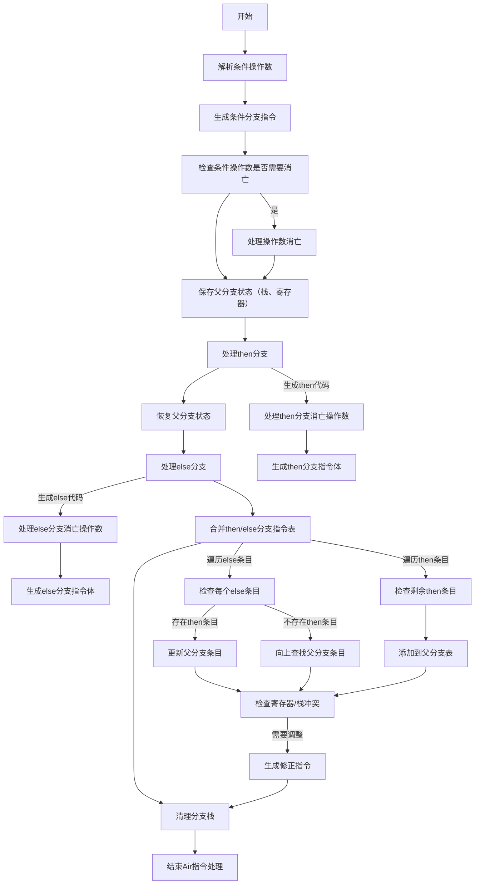

好的，我现在需要帮助用户理解这个用Zig编写的函数，并画出它的流程图。首先，我需要仔细阅读这个函数的代码，了解它的功能和结构。

这个函数名为`airCondBr`，属于`Self`结构体的方法。看起来是处理条件分支的代码生成部分。函数参数是一个`Air.Inst.Index`类型的指令索引。函数的主要逻辑可能涉及到解析条件，生成条件分支的机器码，处理两个分支（then和else）的代码生成，以及合并两个分支后的寄存器分配和栈状态管理。

首先，函数开始部分解析了条件操作数，获取了then和else分支的指令体。然后，使用`condBr`方法生成条件分支的机器码，并处理条件的消亡（如果条件在该指令后不再使用）。

接下来，函数保存了当前的栈和寄存器状态，这是因为两个分支可能需要不同的寄存器分配和栈使用，生成then分支的代码后，恢复父分支的状态，再生成else分支的代码。

在处理完两个分支后，需要合并两个分支中的指令表，确保寄存器分配和栈使用的一致性。这可能涉及到比较两个分支中的指令结果，并将它们统一到父分支的状态中。

最后，函数清理分支栈，并完成Air指令的处理，返回结果。

接下来，我需要将这些步骤转化为流程图。流程图应该包括主要的判断和处理步骤，比如条件解析、生成分支指令、处理then和else分支、状态保存与恢复、合并分支结果等。

需要注意的关键点包括：

1. 解析条件并生成条件分支指令。
2. 处理操作数的消亡。
3. 保存父分支的状态（栈、寄存器）。
4. 生成then分支的代码，处理其中的消亡操作数。
5. 恢复父状态，生成else分支的代码，同样处理消亡操作数。
6. 合并两个分支的指令表，确保寄存器分配一致。
7. 清理资源，返回结果。

可能存在的条件判断包括判断条件操作数是否需要消亡，以及处理分支时是否需要合并不同的寄存器状态。

在绘制流程图时，应该用不同的节点表示这些步骤，并用箭头表示流程的方向。条件判断使用菱形框，处理步骤用矩形框，开始和结束用椭圆框。

需要确保流程图的逻辑清晰，正确反映代码的执行顺序和分支情况。例如，处理完then分支后需要恢复状态，再处理else分支，最后合并两者的结果。

可能还需要考虑错误处理部分，比如`try`和`errdefer`的处理，但用户可能更关注主要流程，暂时可以简化这些部分。

总结起来，流程图的大致结构应该是：

开始 -> 解析条件 -> 生成条件分支 -> 处理条件消亡 -> 保存父状态 -> 处理then分支 -> 恢复父状态 -> 处理else分支 -> 合并分支结果 -> 清理资源 -> 结束。

其中，合并分支结果部分可能包含循环处理每个指令条目，比较并统一状态，这部分在流程图中可能需要用循环结构表示。

现在，我需要将这些步骤转化为Mermaid的流程图语法，确保每个步骤正确对应代码中的操作，并保持逻辑连贯。
================================================
