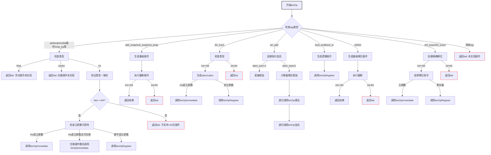

嗯，用户让我用Mermaid画出一个Zig函数的流程图。这个函数是处理二进制操作的，看起来挺复杂的。首先，我需要理解这个函数的结构。函数binOp处理不同的操作标签（tag），根据不同的标签执行不同的逻辑。

首先，函数开始有一个switch语句，根据tag的不同进入不同的分支。比如.add、.sub这些基本操作，然后是.add_wrap这样的包装操作，还有.div_trunc、.ptr_add等等。每个分支内部又有更多的条件判断，比如检查类型是浮点、向量还是整数，处理不同的位宽，以及立即数和寄存器的处理。

我需要把这些逻辑拆解成流程图中的各个节点。每个主要的switch case应该对应一个判断节点，然后根据条件分支到不同的处理步骤。比如，处理.add的时候，会检查类型是否是int，然后判断位宽是否小于等于64位，接着处理立即数或寄存器的情况。

需要注意的是，有些分支会递归调用binOp，比如.ptr_add在处理elem_size不为1时，会调用binOp(.mul)和binOp(tag)。这可能需要循环或子流程来表示。不过Mermaid的流程图可能不太适合递归表示，可能需要简化，用子节点表示。

另外，错误处理部分，比如self.fail返回错误，也需要在流程图中体现出来，作为终止节点。每个条件判断后的结果，如立即数是否可用，也需要分支。

可能需要将整个函数分解为多个部分，每个主要操作标签作为一个主分支，然后在每个分支内部展开条件判断和处理步骤。确保每个可能的路径都有对应的节点和箭头。

最后，要确保流程图的逻辑清晰，不要遗漏重要的判断步骤，同时保持简洁，避免过于复杂。可能需要分层次，先处理顶层tag的分支，再处理每个分支内部的逻辑。
================================================
