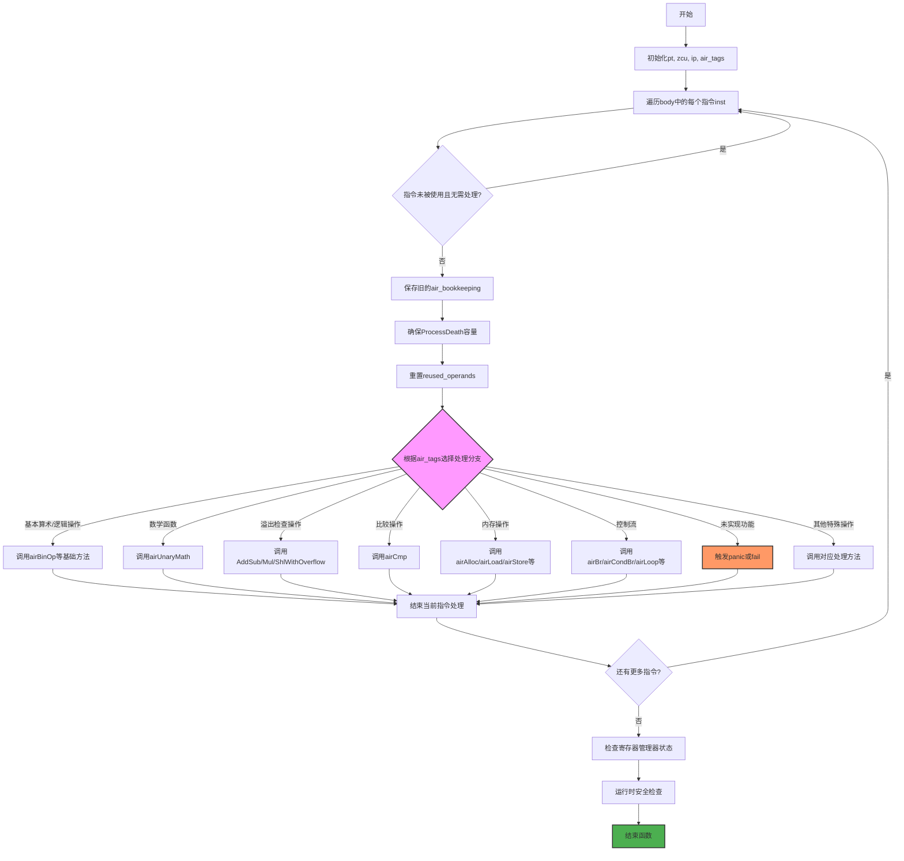

好的，我需要为这个Zig函数`genBody`绘制一个流程图。首先，我得理解这个函数的结构和逻辑。

函数开始处有一些初始化操作，比如获取`pt`、`zcu`、`ip`和`air_tags`。然后是一个循环，遍历`body`中的每个指令`inst`。在循环内部，首先检查指令是否未被使用且不需要强制处理，如果是则跳过。接着处理一些bookkeeping，比如确保容量和重置重用操作数。

然后是一个大的`switch`语句，根据`air_tags`的不同值调用不同的处理方法。很多case调用了类似`self.airBinOp`的函数，还有一些是未实现的，比如`@panic("TODO ...")`或`return self.fail(...)`。循环结束后有断言检查寄存器管理器和一些运行时安全检查。

接下来，我需要将这些步骤转化为流程图。流程图通常包括开始、结束、判断、处理步骤等元素。可能需要用条件判断来表示循环和switch的分支。不过，由于switch有很多case，全部画出会太复杂，可能需要简化，用一个大框表示处理不同的指令类型，并标注一些关键处理或未实现的部分。

另外，循环中的每个指令处理结束后，有断言和运行时检查，这部分也要在流程图中体现。可能的错误处理或panic情况也需要标注。

可能会遇到的挑战是如何简洁地表达庞大的switch分支，同时又不遗漏关键步骤。可能需要将主要流程分成几个大块，比如循环开始、条件跳过、处理指令、结束循环后的检查等。

需要确保流程图的逻辑顺序正确，比如先初始化，然后循环处理每个指令，每个指令内部的判断和处理步骤，以及循环后的断言。
================================================

### 流程图说明：
1. **初始化阶段**：获取上下文信息（pt, zcu等）
2. **主循环**：遍历每条指令，跳过无用指令
3. **指令分发**：通过大switch将不同指令分发到对应处理逻辑
   - 用粉色高亮显示核心分发节点
   - 橙色节点表示未实现功能
4. **后处理**：循环结束后进行状态校验和安全检查
5. **终止节点**：用绿色表示函数正常结束

注：实际代码中switch包含200+分支，此处按功能类别做了聚合展示。完整实现需要为每个具体指令类型添加处理逻辑，未实现部分会触发panic/fail。