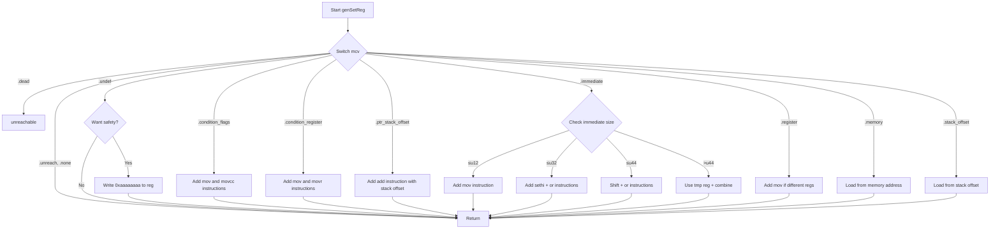

好的，我现在需要帮用户用Mermaid画出一个Zig函数的流程图。这个函数是genSetReg，看起来是用于生成设置寄存器的代码。首先，我得仔细看看这个函数的逻辑结构，然后分解成流程图的不同节点和分支。

首先，函数开始于switch (mcv)，也就是根据不同的MCValue类型处理不同的情况。每个case对应不同的处理逻辑，比如.dead、.unreach、.condition_flags等。每个case里可能有一些操作，比如添加指令、处理立即数、寄存器操作等。

我需要把每个case作为一个分支，画出对应的流程。例如，对于.condition_flags的情况，里面有两个addInst调用，分别生成mov和movcc指令。这时候流程应该是先处理条件标志，然后生成相应的指令，最后结束。

然后是其他情况，比如.immediate需要处理不同范围的立即数，可能需要分解成多个步骤，比如使用sethi和or指令组合，或者使用临时寄存器来处理更大的数值。这时候可能会有多个步骤，需要分支出不同的处理路径。

另外，有些情况会递归调用genSetReg，比如.undef的情况下，当wantSafety为true时，会再次调用genSetReg并传递一个立即数。这种情况需要注意循环或递归的流程表示。

对于.stack_offset的情况，会调用genLoad函数，这里可能需要将genLoad作为一个子流程节点，或者直接简化为一个步骤。

需要注意的是，每个case结束后可能直接返回或者继续执行后续代码。比如.unreach和.none就直接return，而其他情况可能会继续执行到函数结束。

在画流程图的时候，应该从函数入口开始，判断mcv的类型，然后根据不同的类型进入不同的处理分支。每个分支内部的操作步骤要详细列出，比如条件判断、添加指令、寄存器分配等。

可能遇到的困难是如何处理复杂的条件分支，尤其是当有嵌套或递归调用时。例如，处理大立即数时可能需要多次调用genSetReg，这时候需要明确这些调用的流程路径。

另外，需要确保所有case都被覆盖，包括.dead、.unreach、.condition_flags、.condition_register、.undef、.ptr_stack_offset、.immediate、.register、.memory、.stack_offset等，每个都有对应的处理逻辑。

总结一下，流程图的步骤应该是：

1. 函数开始。
2. 检查mcv的类型。
3. 根据不同的类型进入对应的处理分支。
4. 每个分支内执行相应的操作，可能包括添加指令、处理立即数、调用其他函数等。
5. 处理完毕后，结束该分支，可能返回或继续执行后续代码。

现在需要将这些步骤转化为Mermaid的流程图语法，使用不同的节点和箭头连接各个分支。
================================================
