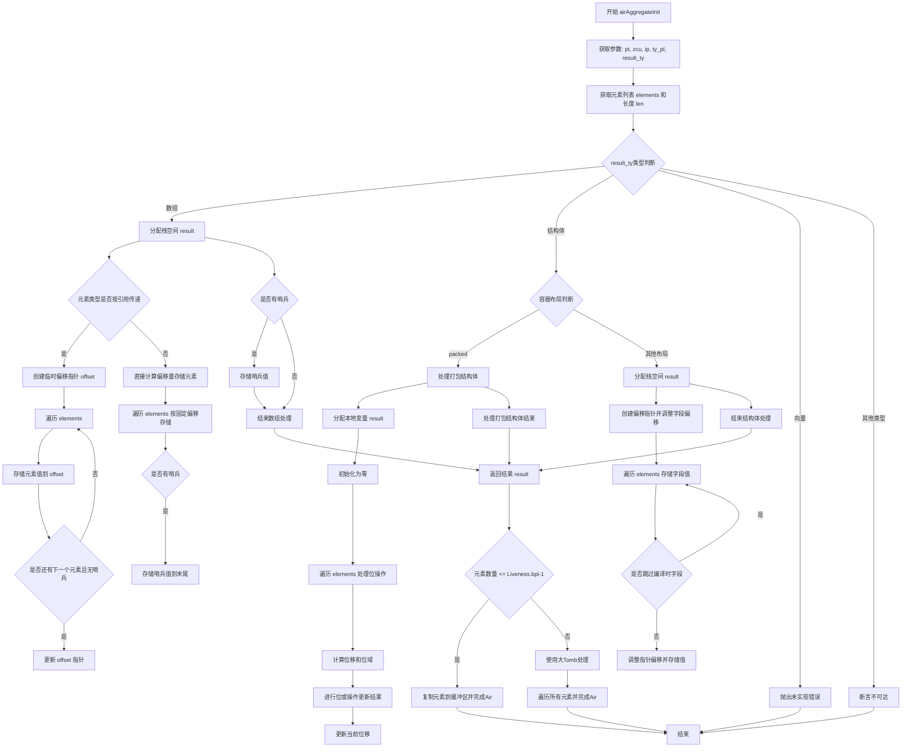

好的，我需要为提供的Zig函数`airAggregateInit`绘制流程图。首先，我需要理解这个函数的结构和逻辑流程。这个函数处理聚合类型的初始化，比如数组、结构体和可能的向量。根据不同的类型，处理方式也不同。

首先，函数开始获取一些基本参数，比如类型信息、长度和元素列表。然后根据结果类型的不同，进入不同的处理分支。对于数组类型，它分配栈空间，处理每个元素的存储，考虑元素是否为引用类型，以及是否有哨兵值。对于结构体类型，又分为打包结构体（packed struct）和其他布局的结构体。打包结构体需要处理位操作，而普通结构体则处理字段偏移和存储。最后，处理向量的情况目前还未实现。

我需要将这些逻辑分支用流程图的形式表现出来。可能需要使用条件判断节点来表示不同类型的处理，循环节点表示遍历元素，以及不同的操作步骤如分配内存、存储值等。同时，要注意错误处理和未实现部分的标注。

在绘制流程图时，应该从函数入口开始，依次处理各个步骤，根据不同的类型分支到相应的处理流程。每个分支内部的操作步骤需要详细展开，比如数组处理中的元素存储循环，结构体处理中的字段偏移调整等。此外，需要注意返回结果和后续的收尾工作，比如调用`finishAir`函数。

可能遇到的挑战是如何清晰地表达复杂的条件分支和循环结构，同时保持流程图的简洁和易读。需要合理使用子流程或分组来组织不同的处理部分，避免交叉和混乱。另外，确保所有的路径都被覆盖，包括错误返回和未实现的TODO部分。

最后，根据上述分析，使用Mermaid语法绘制出结构清晰的流程图，涵盖所有主要逻辑分支和关键步骤。
================================================

该流程图展示了函数`airAggregateInit`的主要逻辑分支：
1. **数组处理**分为按引用存储（动态指针偏移）和按值存储（固定偏移）
2. **结构体处理**分为打包结构体（位操作）和普通结构体（字段偏移计算）
3. 向量类型暂未实现
4. 结果处理根据元素数量选择不同的完成路径
5. 包含哨兵值处理、位运算、指针操作等关键步骤
6. 使用条件判断、循环和子流程清晰表达复杂类型处理逻辑