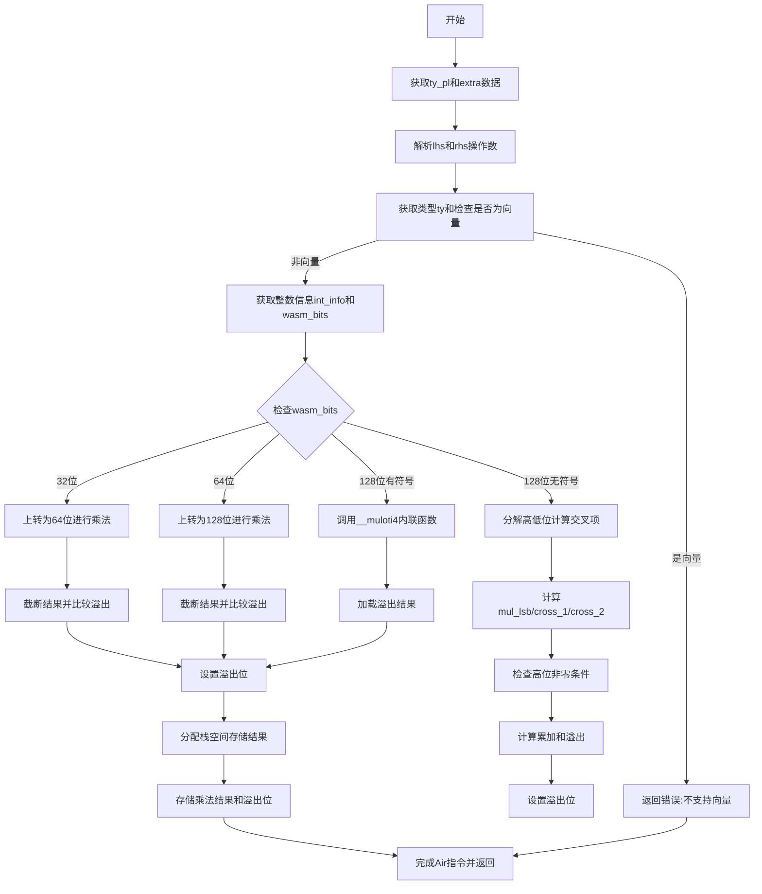

嗯，我需要为这个Zig函数`airMulWithOverflow`绘制一个流程图。首先，我应该仔细阅读代码，理解它的结构和逻辑流程。这个函数处理带有溢出的乘法操作，根据不同的整数类型和位宽有不同的处理分支。

首先，函数开始获取指令的数据类型和操作数，解析左右操作数。然后根据类型是否为向量决定是否支持，目前不支持向量，所以直接返回错误。

接下来，处理不同的整数位宽：32位、64位、128位。对于32位和64位，会进行上转型运算，然后截断，比较结果是否溢出，设置溢出位。对于128位无符号整数，分解高低位，进行乘法运算，处理交叉项，检查溢出条件。对于有符号128位整数，调用特定的内联函数`__muloti4`来处理溢出。

每个分支处理完乘法结果和溢出位后，将结果和溢出位存储到栈分配的内存中，最后返回结果。

我需要将这些步骤转化为流程图的不同节点，包括条件判断和各个处理分支。可能的结构是开始节点，然后检查类型是否为向量，如果是则报错。否则，根据整数位宽进入不同的处理流程，每个流程内部处理相应的乘法和溢出检测，最后合并到存储结果和结束流程。

要注意各个分支的条件判断，比如`wasm_bits`的值，以及是否为有符号或无符号类型。同时，需要处理不同位宽时的不同处理逻辑，比如32位上转为64位，128位分解为两个64位部分等。

可能还需要考虑异常处理和资源释放，比如`defer`语句中的`free`操作，但在流程图中可能不需要详细体现，主要关注控制流和数据流。

最后，将结果存储到栈中，并完成Air指令的处理，返回结果。整个流程需要分步骤，用判断框和过程框表示不同的处理路径。
================================================
