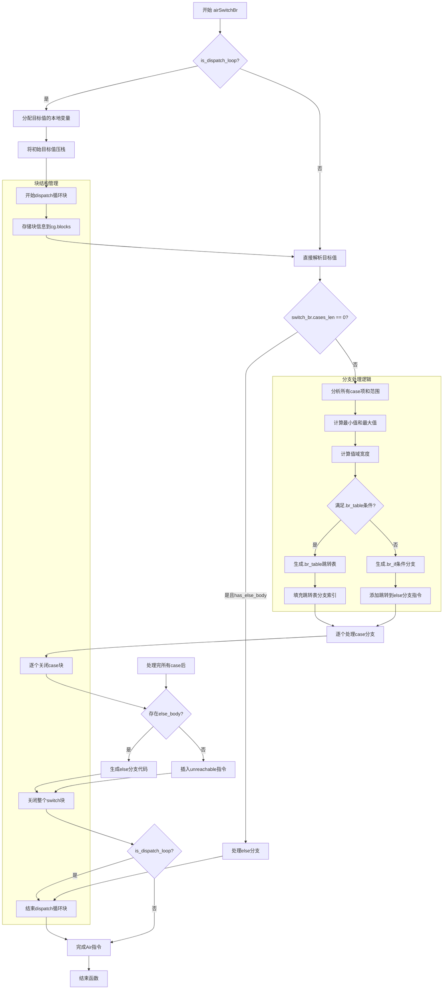

好的，我需要为提供的Zig函数`airSwitchBr`绘制流程图。首先，我需要理解这个函数的功能和结构。这个函数似乎是处理一个switch分支的代码生成，特别是针对WebAssembly（WASM）目标。函数中涉及条件分支、循环、块结构以及不同的分支策略（比如使用.br_table或.br_if）。

首先，我会通读代码，了解主要的逻辑步骤：

1. **初始化和参数检查**：函数开始时进行了一些断言和初始化，确保目标类型有运行时位。
2. **处理dispatch循环**：根据`is_dispatch_loop`标志，可能交换目标值并开始一个循环块。
3. **处理分支情况**：包括处理case项和范围，计算最小值和最大值，确定分支策略（使用.br_table还是.br_if）。
4. **生成分支代码**：根据选择的分支策略，生成相应的跳转表或条件分支指令。
5. **处理else分支**：如果有else分支，生成相应的代码，否则插入unreachable指令。
6. **结束块和循环**：关闭之前打开的块和可能的dispatch循环。

接下来，我需要将这些步骤转化为流程图的结构。流程图应该包括开始和结束节点，条件判断（比如是否使用.br_table），循环处理，以及各个分支的生成过程。

需要注意的是，函数中有多个嵌套的块（block）和循环（loop），这些结构在流程图中需要用不同的形状或注释来表示。例如，使用菱形表示条件判断，矩形表示处理步骤，箭头表示流程方向。

可能遇到的挑战是如何准确表示代码中的嵌套块和条件分支，特别是当存在多个分支策略时。需要确保流程图的逻辑与代码结构一致，避免遗漏关键步骤。

最后，我会使用Mermaid语法将上述分析转化为流程图，确保每个步骤和条件都正确对应代码中的结构。
================================================
